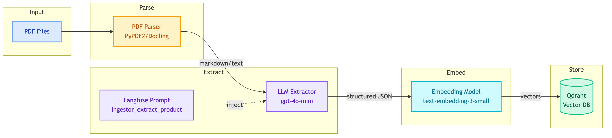
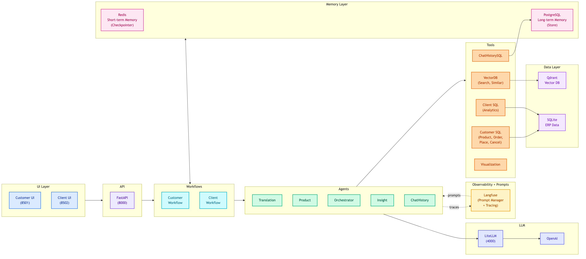
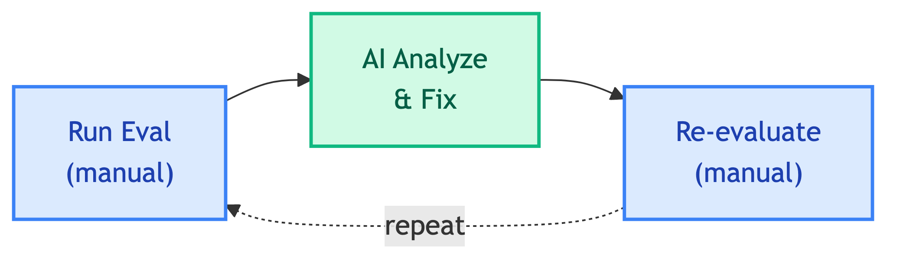

# **📚 MTL Agent Documentation**

Documentation for the MTL Agent ERP multi-agent system.

> 💡 **Tip:** New to the project? Start with the [Quick Start](../README.md#-quick-start) guide or explore the [Guides](guides/README.md).

---

## **🔄 System Flow**

### 1️⃣ **Data Ingestion**

Ingest product PDFs into vector database for semantic search.

→ See [Ingestor Pipeline](ingestor/README.md)

---

### 2️⃣ **Multi-Agent System**

Process user queries through agents, tools, and workflows.

→ See [Multi-Agent Systems](multi-agent-systems/README.md)

---

### 3️⃣ **Evaluation & Improvement**

Run LLM-as-Judge evaluation to measure and improve quality.

→ See [Evaluation](evaluation/README.md)

---

## **📖 Documentation**

| | | |
|:---:|:---:|:---:|
| [🤖 **Multi-Agent Systems**](multi-agent-systems/README.md) Agents, tools, workflows, repositories | [📝 **Decisions**](decisions/README.md) Architecture decision records | [🔧 **Infrastructure**](infrastructure/README.md) Docker services, setup guides |
| [📦 **Libs**](libs/README.md) Reusable libraries | [📖 **Guides**](guides/README.md) User, developer, data science guides | [💬 **Prompts**](prompts/README.md) Prompt management with Langfuse |
| [🗄️ **Databases**](database/README.md) SQLite, PostgreSQL, Redis | [⚙️ **Ingestor**](ingestor/README.md) PDF ingestion pipeline | [🧪 **Evaluation**](evaluation/README.md) Testing and LLM-as-Judge |
| [🔮 **Future**](future_improvements/README.md) Potential enhancements | | |
