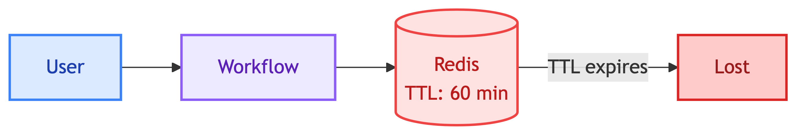
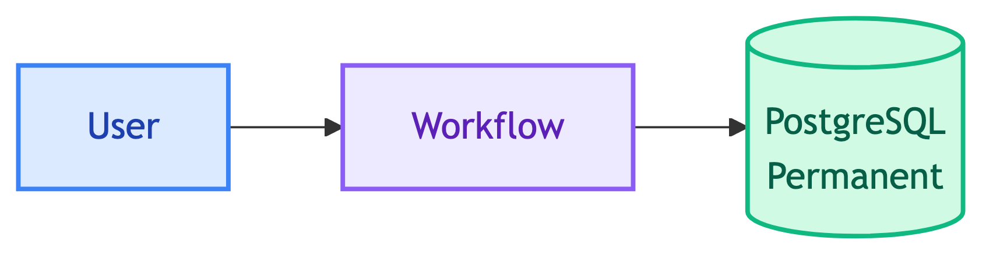
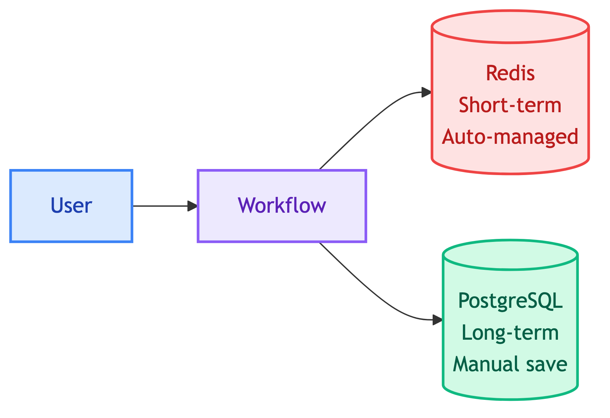
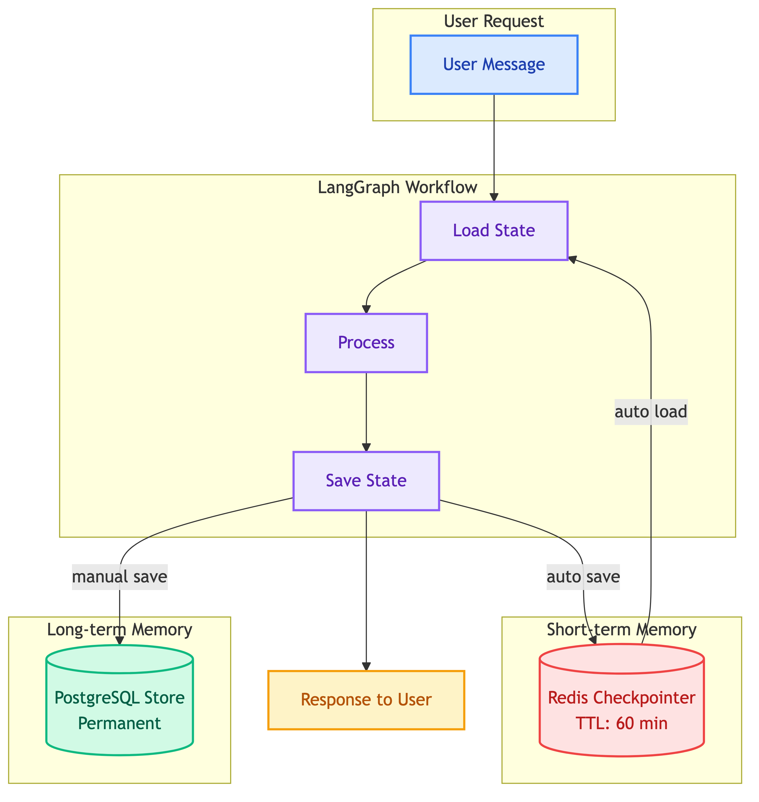

# **📝 Why Checkpointer + Store for Memory**


---


## **🎯 Decision**

Use both **Redis Checkpointer** (short-term) and **Postgres Store** (long-term) for conversation memory.


---


## **📋 Context**

LangGraph provides two memory mechanisms:

| Component | Scope | Purpose |
|-----------|-------|---------|
| **Checkpointer** | Per-thread | Working memory within active conversation |
| **Store** | Cross-thread | Persistent memory across conversations |

We needed to decide how to manage conversation memory for the customer chatbot.


---


## **🔄 Options Considered**


### 1️⃣ **Checkpointer Only (Redis)**



- Simple setup
- Memory lost after TTL expires
- No cross-thread memory


### 2️⃣ **Store Only (Postgres)**



- Permanent storage
- Slower than Redis
- No automatic state management


### 3️⃣ **Checkpointer + Store (Chosen)**



- Fast working memory (Redis)
- Permanent backup (Postgres)
- Best of both worlds


---


## **✅ Decision**

Chose **Option 3: Checkpointer + Store**.


---


## **💡 Rationale**

1. **Different TTL requirements**
   - Active conversation: needs fast access (Redis, TTL 60 min)
   - Historical data: needs permanent storage (Postgres)

2. **Different access patterns**
   - Checkpointer: LangGraph auto-manages state per thread
   - Store: Manual save/search for cross-thread queries

3. **Fault tolerance**
   - If Redis crashes: conversation resumes from last checkpoint
   - Historical conversations: safe in Postgres

4. **Future use cases**
   - Resume old conversations after TTL expired
   - Audit/Compliance reporting


---


## **🏗️ Architecture**

<details>
<summary>View Memory Architecture</summary>



</details>


---


## **🔄 Data Flow**

```
1. User sends message
2. LangGraph loads state from Redis Checkpointer (auto)
3. Workflow processes message
4. LangGraph saves state to Redis Checkpointer (auto)
5. Workflow saves turn to Postgres Store (manual)
6. Response returned to user
```


---


## **💾 Storage Format**


### 🔴 **Redis Checkpointer (managed by LangGraph)**

```
Key: langgraph:checkpoint:{thread_id}
Value: {
    "channel_values": {
        "messages": [...],
        "query": "...",
        "response": "..."
    }
}
TTL: 60 minutes
```


### 🐘 **Postgres Store (managed by us)**

```
Namespace: ("users", user_id, "conversations")
Key: "{thread_id}_{timestamp}_{uuid}"
Value: {
    "query": "หาลำโพงบลูทูธ",
    "response": "นี่คือลำโพง...",
    "thread_id": "abc123",
    "timestamp": "2025-01-15T10:30:00"
}
```

> 📝 **Note:** Namespace = folder hierarchy for organizing data, e.g., `("users", "user-123", "conversations")` similar to path `users/user-123/conversations/`


---


## **⚖️ Trade-offs**

| Aspect | Checkpointer Only | Store Only | Both |
|--------|-------------------|------------|------|
| Speed | Fast | Slower | Fast (Redis) |
| Durability | TTL limited | Permanent | Both |
| Complexity | Simple | Simple | Higher |
| Storage cost | Low | Higher | Highest |
| Cross-thread | No | Yes | Yes |


---


## **🎯 When to Use Store Data**

| Use Case | Example | When |
|----------|---------|------|
| Resume old conversation | "เมื่อวานถามเรื่องลำโพง" | TTL expired |
| Audit/Compliance | Admin review | Reporting |


---


## **🔗 References**

- [LangGraph Memory Concepts](https://docs.langchain.com/oss/python/langgraph/memory)
- [LangGraph Checkpointers](https://langchain-ai.github.io/langgraph/concepts/persistence/)
- [LangGraph Stores](https://langchain-ai.github.io/langgraph/concepts/persistence/#stores)
