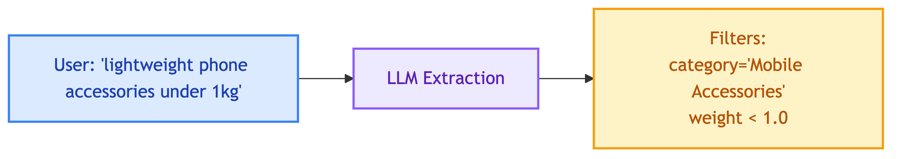

# **📝 Why Flat Text Payload**


---


## **🎯 Decision**

Store extracted product data as flat `text` field instead of structured fields.


---


## **📋 Context**

When ingesting product data to Qdrant, we can either:
1. **Flat text**: Combine all fields into single `text` for embedding
2. **Structured**: Store each field separately for filtering


---


## **📦 Current Format**

```json
{
  "product_id": 10,
  "product_name": "Smartphone Tripod",
  "source_file": "10_smartphone_tripod.pdf",
  "text": "Smartphone Tripod... category: Mobile & Tablets, weight: 0.5 kg, material: aluminum alloy..."
}
```


---


## **💡 Why Flat Text**


### 1️⃣ **Simpler RAG Pipeline**

| Approach | Steps |
|----------|-------|
| Flat text | Query → Embed → Vector search → Results |
| Structured | Query → LLM extract filters → Build filter query → Vector search → Results |

> 📝 **Note:** Structured filtering requires an extra LLM call to extract filter values from user query.


### 2️⃣ **No Filter Mapping Required**

With structured fields, user query must be parsed to match exact field names:



This adds complexity and potential for mismatches.


### 3️⃣ **Semantic Search Handles It**

Vector similarity naturally matches:
- "lightweight" → matches "0.5 kg", "easy to carry"
- "phone accessories" → matches "Mobile & Tablets", "smartphone"

No explicit filtering needed - embeddings capture semantic meaning.


---


## **⚖️ Trade-offs**

| Pros | Cons |
|------|------|
| Simple pipeline | No exact filtering |
| No extra LLM call | Can't facet by category |
| Semantic matching works | Less precise for numeric ranges |


---


## **🔮 When to Use Structured**

Consider structured payload if:
- Need faceted search (show counts per category)
- Need exact numeric filtering (price < $100)
- Need boolean filters (in_stock = true)

See [Future Improvements: Structured Payload](../future_improvements/ingestion/structured_payload.md)
