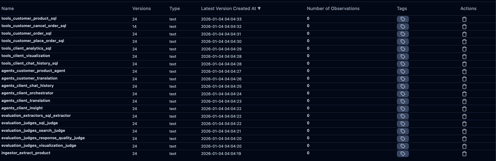
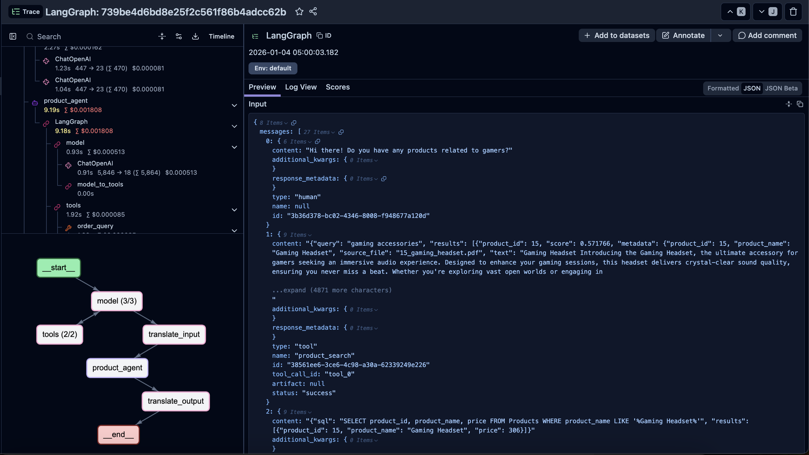
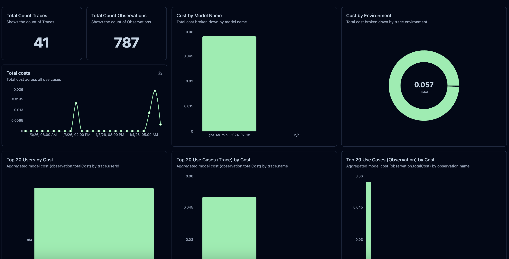

# **📝 Why Langfuse**

---

## **🎯 Decision**

Use **Langfuse** as the LLM observability and prompt management platform.

---

## **📋 Context**

Building LLM-powered applications requires:
- **Observability**: Trace LLM calls, monitor latency, debug issues
- **Cost Tracking**: Monitor token usage and costs across models
- **Prompt Management**: Version, test, and deploy prompts safely
- **Evaluation**: Score and evaluate LLM outputs for quality

---

## **🔄 Options Considered**

| Feature | Langfuse | LangSmith | Phoenix (Arize) |
|---------|----------|-----------|-----------------|
| Open Source | Yes (self-host) | No | Yes |
| Cloud Hosted | Yes (free tier) | Yes | Yes |
| Tracing | Full trace hierarchy | Full trace hierarchy | Full trace hierarchy |
| Prompt Management | Built-in versioning | Prompt Hub | No |
| Cost Tracking | Automatic | Automatic | Manual |
| Evaluation | Scores, datasets, experiments | Datasets, evaluators | Evals framework |
| Pricing | Free tier + usage | Per trace pricing | Free (OSS) |
| LiteLLM Integration | Native | Via callbacks | Via callbacks |

---

## **💡 Decision Rationale**

### 1️⃣ **Integrated Prompt Management**

Langfuse provides built-in prompt versioning with labels (`latest`, `production`), allowing safe prompt iteration without code changes.

*Prompt list showing versions, labels (latest/production), and last used timestamps*

### 2️⃣ **Comprehensive Tracing**

Full visibility into LLM call hierarchy with input/output inspection, token counts, latency, and cost per trace.

*Trace detail view showing session hierarchy, model calls, and metadata*

### 3️⃣ **Cost and Usage Analytics**

Built-in dashboard for monitoring costs, model usage distribution, and trace volumes.

*Dashboard showing trace counts, total cost, model usage breakdown, and trends*

### 4️⃣ **Self-Hosting Option**

Can be self-hosted for data privacy requirements, or use cloud version for quick setup.

---

## **⚖️ Trade-offs**

### ✅ Pros
- Free tier sufficient for development
- Prompt management built-in
- Native LiteLLM integration
- Open source option

### ❌ Cons
- Cloud version has usage limits
- Self-hosting requires infrastructure
- Fewer integrations than LangSmith
- Smaller community than alternatives

---

## **🔗 References**

- [Langfuse Documentation](https://langfuse.com/docs)
- [Langfuse Prompt Management](https://langfuse.com/docs/prompts)
- [Langfuse Scores & Evaluation](https://langfuse.com/docs/scores)
