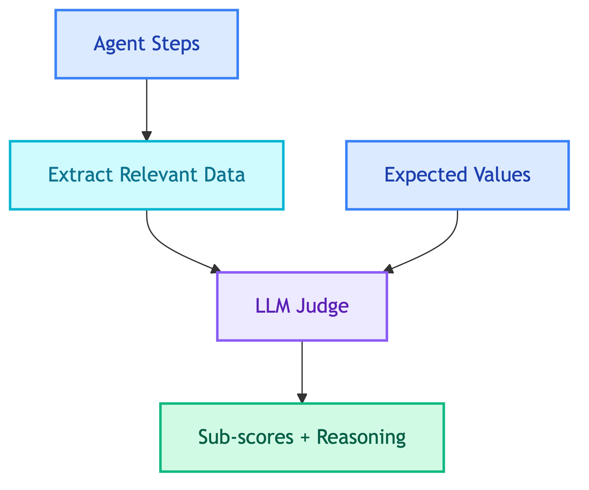
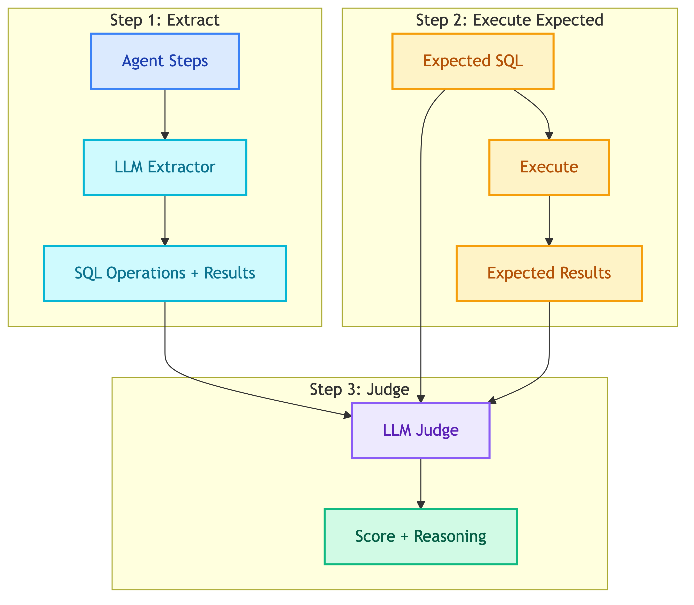

# **📝 LLM-as-Judge Design Decision**


---


## **📋 Context**

We need to evaluate chatbot responses across multiple dimensions (SQL correctness, search quality, visualization, response quality). Traditional rule-based evaluation is brittle and can't handle semantic equivalence.


---


## **🔄 Options Considered**


### 🅰️ **Rule-based evaluation**

```
1. Execute queries/searches
2. Compare results programmatically
3. Check exact matches
```

**Pros:**
- Fast, deterministic
- No LLM cost

**Cons:**
- Can't handle semantic equivalence
- Brittle to minor differences
- Hard to evaluate quality (faithfulness, relevance)


### 🅱️ **LLM-as-Judge**

```
1. Extract relevant data from agent steps
2. Send to LLM with expected values
3. LLM evaluates and returns sub-scores
```

**Pros:**
- Understands semantic equivalence
- Can evaluate subjective quality
- Provides reasoning for scores
- Handles negative cases naturally

**Cons:**
- LLM cost
- Non-deterministic


---


## **✅ Decision**

**Option B: LLM-as-Judge**


---


## **🎯 Pattern**

All judges follow the same pattern:




---


## **⚖️ Judges**

| Judge | Extracts | Evaluates |
|-------|----------|-----------|
| SQL | SQL operations + results | Result match, efficiency |
| Search | Search tool calls | Relevance, coverage |
| Visualization | Viz tool calls | Appropriateness, chart type |
| Response Quality | Final response | Relevance, faithfulness |


---


## **🔷 SQL Judge Flow**

SQL Judge has an additional step - executing expected SQL for ground truth:

<details>
<summary>📊 SQL Judge Flow</summary>



</details>


---


## **📊 Sub-scores by Judge**

| Judge | Sub-scores | Weights |
|-------|------------|---------|
| SQL | result_match (70%), efficiency (30%) | Weighted |
| Search | relevance (50%), coverage (50%) | Equal |
| Visualization | appropriateness (50%), chart_type (50%) | Equal |
| Response Quality | relevance (50%), faithfulness (50%) | Equal |


---


## **❌ Negative Cases**

All judges support negative test cases:

| Expected Value | Meaning |
|----------------|---------|
| `sql: "null"` | Should not generate SQL |
| `search_results: "null"` | Should not search |
| `has_chart: false` | Should not create chart |
| `response_quality: "null"` | Should not respond |


---


## **📝 Prompts**

Each judge uses Langfuse-managed prompts:

| Judge | Prompt Name |
|-------|-------------|
| SQL (extractor) | `evaluation_extractors_sql_extractor` |
| SQL (judge) | `evaluation_judges_sql_judge` |
| Search | `evaluation_judges_search_judge` |
| Visualization | `evaluation_judges_visualization_judge` |
| Response Quality | `evaluation_judges_response_quality_judge` |


