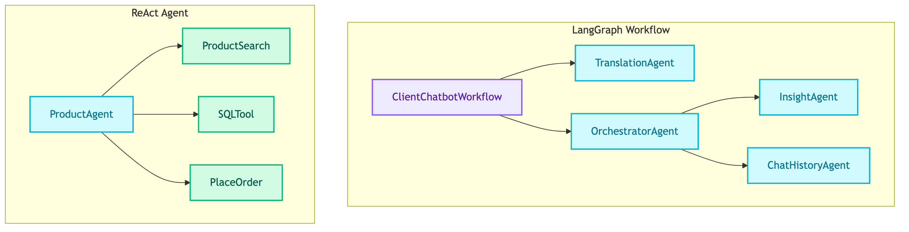
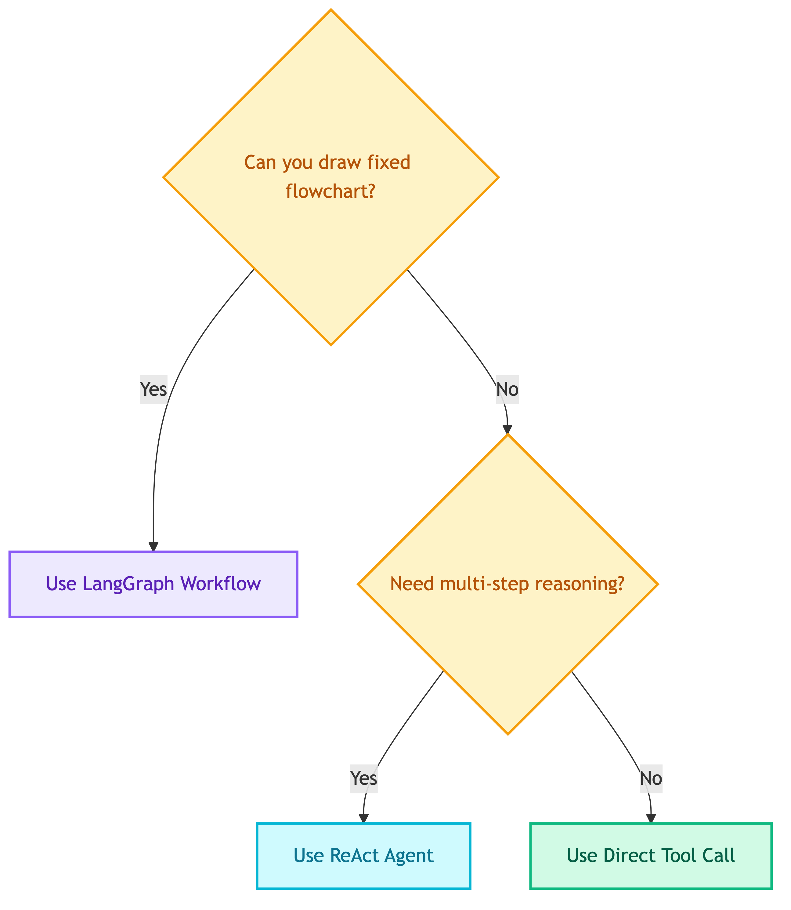

# **📝 Why ReAct Agents and LangGraph Workflows**


---


## **🎯 Decision**

Use **LangGraph Workflows** for predictable orchestration and **ReAct Agents** for open-ended tool usage.


---


## **📋 Context**

We need to orchestrate multiple agents and tools. Two patterns are available:

| Pattern | Use Case | Example |
|---------|----------|---------|
| LangGraph Workflow | Fixed, predictable flows | translate → route → process → translate |
| ReAct Agent | Open-ended, dynamic tool usage | ProductAgent choosing search/stock/order tools |


---


## **🏗️ Architecture**




---


## **🔄 LangGraph Workflows**

Use for **predictable, fixed flows** where the sequence is known at design time.


### 🎯 **When to Use**

| Scenario | Why Workflow |
|----------|--------------|
| Fixed sequence (translate → process → translate) | Deterministic, auditable |
| Real-time/low-latency (<500ms) | Single LLM call per node |
| Cost-sensitive (high volume) | Predictable token usage |
| Regulated (finance/healthcare) | Explicit logging, compliance |


### 💡 **Example: ClientChatbotWorkflow**

```python
from langgraph.graph import StateGraph, START, END

workflow = StateGraph(ClientChatbotState)
workflow.add_edge(START, "translate_input")
workflow.add_edge("translate_input", "orchestrator")
workflow.add_conditional_edges("orchestrator", route_by_intent, {
    "chat_history": "chat_history",
    "insight": "insight",
})
workflow.add_edge("chat_history", "translate_output")
workflow.add_edge("insight", "translate_output")
workflow.add_edge("translate_output", END)
```


---


## **🤖 ReAct Agents**

Use for **open-ended queries** where the LLM needs to discover which tools to use.


### 🎯 **When to Use**

| Scenario | Why ReAct |
|----------|-----------|
| Open-ended queries | LLM discovers tool sequence |
| Multi-step reasoning | "search then check stock" |
| Unpredictable intent | User might search, compare, or order |
| Tool composition | Combine multiple tools dynamically |


### 💡 **Example: ProductAgent**

```python
from langchain.agents import create_react_agent

agent = create_react_agent(
    model=llm,
    tools=[product_search, similar_products, sql_tool, place_order],
    prompt=system_prompt,
)
```


---


## **🎯 Decision Framework**

<details>
<summary>📊 Decision Framework</summary>



</details>

> 💡 **Tip:** If you can draw the flow as a flowchart with fixed steps → use workflow. If the LLM needs to discover/adapt → use ReAct.


---


## **⚖️ Trade-offs**

| Aspect | LangGraph Workflow | ReAct Agent |
|--------|-------------------|-------------|
| Predictability | High | Low |
| Latency | Low (1 LLM call/node) | High (multiple reasoning steps) |
| Token cost | Predictable | Unpredictable |
| Debugging | Easy (explicit flow) | Harder (LLM reasoning) |
| Flexibility | Low | High |
| Auditability | High | Medium |


---


## **📦 Our Implementation**

| Component | Pattern | Rationale |
|-----------|---------|-----------|
| ClientChatbotWorkflow | Workflow | Fixed: translate → route → agent → translate |
| CustomerChatbotWorkflow | Workflow | Fixed: translate → agent → translate |
| ProductAgent | ReAct | Open-ended product queries |
| InsightAgent | ReAct | Dynamic SQL + visualization |
| ChatHistoryAgent | ReAct | Dynamic store queries |
| TranslationAgent | Simple | Single LLM call, no tools |
| OrchestratorAgent | Simple | Single LLM call, classification only |


---


## **⚠️ Anti-patterns**


### ❌ **Don't use ReAct for fixed sequences**

```python
# ❌ BAD: ReAct for fixed ETL pipeline
agent = create_react_agent(model, [fetch_data, validate, transform, store])

# ✅ GOOD: Fixed workflow
workflow = StateGraph(State)
workflow.add_edge(START, "fetch_data")
workflow.add_edge("fetch_data", "validate")
workflow.add_edge("validate", "transform")
workflow.add_edge("transform", "store")
workflow.add_edge("store", END)
```


### ❌ **Don't use Workflow for open-ended queries**

```python
# ❌ BAD: Hardcoded routing for product queries
workflow.add_conditional_edges("router", {
    "search": "search_node",
    "stock": "stock_node",
    "compare": "compare_node",
})

# ✅ GOOD: Let LLM decide dynamically
agent = create_react_agent(model, [search, stock, compare, order])
```


---


## **🔗 References**

- [LangGraph Concepts](https://langchain-ai.github.io/langgraph/concepts/)
- [ReAct Agent from Scratch](https://langchain-ai.github.io/langgraph/how-tos/react-agent-from-scratch/)
- [Workflows vs Agents](https://langchain-ai.github.io/langgraph/concepts/agentic_concepts/)
