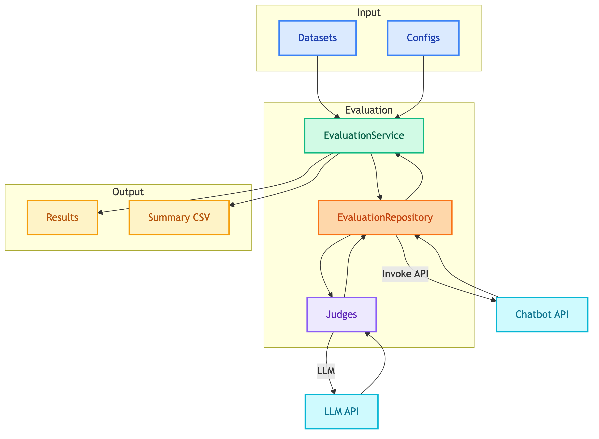

# **🧪 Evaluation Framework**

LLM-as-Judge evaluation framework for multi-agent chatbots.


---


## **📑 Table of Contents**

- [Overview](#-overview)
- [Quick Start](#-quick-start)
- [Documentation](#-documentation)
- [Judges](#-judges)
- [Directory Structure](#-directory-structure)
- [Design Decisions](#-design-decisions)


---


## **📋 Overview**

Evaluates chatbot responses using multiple judges that assess different aspects of the response.




---


## **🚀 Quick Start**

### **Run All Tests**

```bash
python scripts/run_eval.py customer
python scripts/run_eval.py client
```

### **Run Specific Directory**

```bash
python scripts/run_eval.py customer --path data/eval_datasets/customer/browse_products
```

### **Run Single YAML File**

```bash
python scripts/run_eval.py customer --path data/eval_datasets/customer/browse_products/single_turn/search.yaml
```

### **Run Multiple Paths**

```bash
python scripts/run_eval.py customer \
    --path data/eval_datasets/customer/browse_products \
    --path data/eval_datasets/customer/place_order
```


---


## **📖 Documentation**

| | | |
|:---:|:---:|:---:|
| [🏗️ **Architecture**](architecture.md)<br/>System design and flow | [⚖️ **Judges**](judges/README.md)<br/>Judge types and scoring | [📊 **Datasets**](datasets.md)<br/>Test case format |
| [⚙️ **Configs**](configs.md)<br/>Evaluation configuration | [📈 **Results**](results.md)<br/>Output format | [💡 **Examples**](examples.md)<br/>Real test examples |
| [🔄 **Iteration**](iteration.md)<br/>Analyze & improve with AI | | |


---


## **⚖️ Judges**

| Judge | Purpose | Used By |
|-------|---------|---------|
| SQL | SQL query correctness | Both |
| Search | Vector search quality | Customer |
| Visualization | Chart generation quality | Client |
| Response Quality | Response relevance and faithfulness | Both |


---


## **📁 Directory Structure**

```
evaluation/
├── entities.py              # Data classes (TestCase, JudgeResult, etc.)
├── loader.py                # DatasetLoader
├── judges/
│   ├── base.py              # BaseJudge
│   ├── selector.py          # JudgeSelector
│   ├── sql/main.py          # SQLJudge
│   ├── search/main.py       # SearchJudge
│   ├── visualization/main.py # VisualizationJudge
│   └── response_quality/main.py # ResponseQualityJudge
├── repositories/
│   ├── base.py              # BaseEvaluationRepository
│   └── main.py              # EvaluationRepository
├── usecases/
│   └── main.py              # EvaluationService
└── dependencies/
    ├── customer.py          # Customer eval factory
    └── client.py            # Client eval factory
```


---


## **📝 Design Decisions**

| Decision | Link |
|----------|------|
| LLM-as-Judge | [why_llm_as_judge.md](../decisions/why_llm_as_judge.md) |
