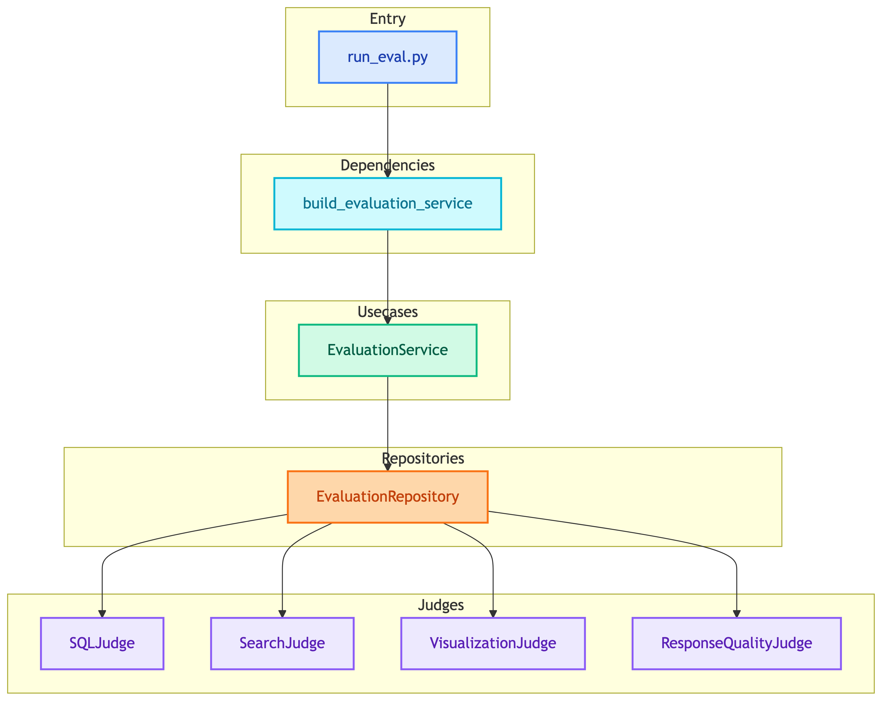
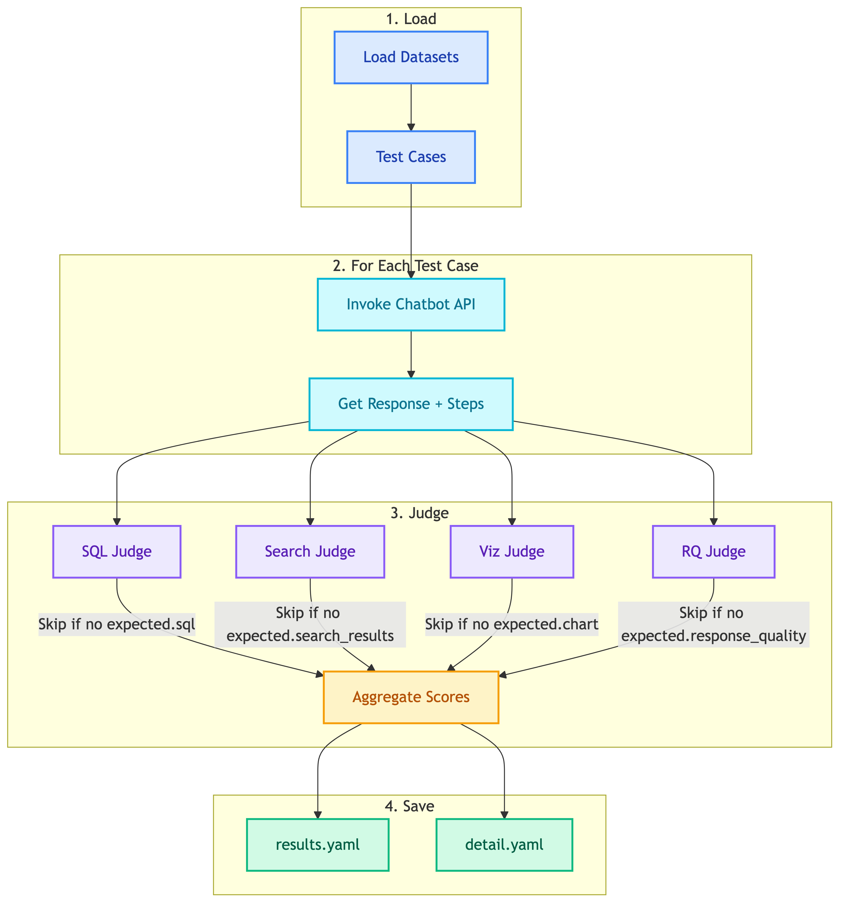
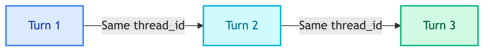

# **🏗️ Evaluation Architecture**

System design and request flow.

---

## **📊 Layers**

📊 Layers

| Layer | Location | Responsibility |
|-------|----------|----------------|
| CLI | `scripts/run_eval.py` | Entry point, select chatbot type |
| Dependencies | `evaluation/dependencies/` | Factory, wire components |
| Usecases | `evaluation/usecases/` | Orchestrate evaluation run |
| Repositories | `evaluation/repositories/` | Load data, invoke API, run judges |
| Judges | `evaluation/judges/` | Evaluate specific aspects |

---

## **🔄 Evaluation Flow**

📊 Evaluation Flow

---

## **🔀 Single-Turn vs Multi-Turn**

| Type | Description | Thread ID |
|------|-------------|-----------|
| Single-turn | One question, one response | New UUID per test |
| Multi-turn | Multiple turns in sequence | Same UUID for all turns |

### 🔄 **Multi-Turn Flow**

Each turn is evaluated separately, scores are aggregated.

---

## **⚖️ Judge Selection**

Judges are selected based on `expected` fields in test case:

| Expected Field | Judge Activated |
|----------------|-----------------|
| `sql` | SQLJudge |
| `search_results` | SearchJudge |
| `chart` | VisualizationJudge |
| `response_quality` | ResponseQualityJudge |

> 📝 **Note:** If expected field is missing, judge returns `None` (skipped).

---

## **❌ Negative Cases**

For negative test cases:
- `sql: "null"` → Pass if no SQL generated
- `search_results: []` → Pass if no results found
- `chart: "null"` → Pass if no chart generated

