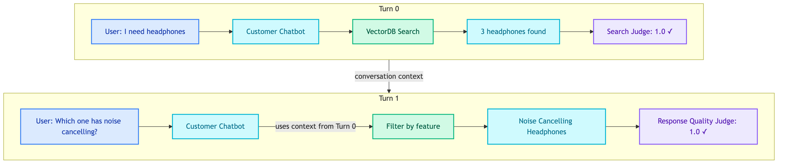

# **💡 Evaluation Examples**

Real examples from evaluation runs showing input, output, and judge results.


---


## **🔹 Single-Turn Example**

**Test ID:** `search_gaming`

A simple one-question test for product search.


### 📄 **Test Case**

```yaml
test_id: search_gaming
type: single_turn
input:
  question: I need gaming accessories
expected:
  search_results:
    - Gaming Headset
    - Wireless Gaming Mouse
```


### 🤖 **Chatbot Response**

```
Here are some gaming accessories you might be interested in:

1. **Gaming Headset**
   - **Price:** $306
   - **Description:** The ultimate accessory for gamers seeking an immersive audio experience.

2. **Gaming Chair**
   - **Price:** $279
   - **Description:** Ergonomic gaming chair with lumbar support.

3. **Wireless Gaming Mouse**
   - **Price:** $89
   - **Description:** High-precision wireless mouse for gaming.
```


### ⚖️ **Judge Results**

```yaml
judge_results:
  search:
    score: 1.0
    passed: true
    expected:
      results:
        - Gaming Headset
        - Wireless Gaming Mouse
    actual:
      results:
        - Gaming Headset
        - Gaming Chair
        - Wireless Gaming Mouse
    sub_scores:
      relevance:
        score: 1.0
        reasoning: The search results are highly relevant to the user's query
                   for 'gaming accessories'. All the products listed are
                   accessories commonly associated with gaming.
      coverage:
        score: 1.0
        reasoning: Both of the expected products, 'Gaming Headset' and
                   'Wireless Gaming Mouse', are found in the search results.
                   Therefore, the coverage is complete.
```


### 🔄 **Flow Diagram**


### 📊 **Summary**

| Metric | Value |
|--------|-------|
| Passed | ✓ Yes |
| Overall Score | 1.0 |
| Latency | 14,277 ms |
| Judge | Search |
| Relevance Score | 1.0 |
| Coverage Score | 1.0 |


---


## **🔸 Multi-Turn Example**

**Test ID:** `refine_search`

A conversation with follow-up questions testing context retention.


### 📄 **Test Case**

```yaml
test_id: refine_search
type: multi_turn
turns:
  - input:
      question: I need headphones
    expected:
      search_results:
        - Wireless Bluetooth Headphones
        - Noise Cancelling Headphones
        - Gaming Headset

  - input:
      question: Which one has noise cancelling?
    expected:
      response_quality: Noise Cancelling Headphones
```


### 0️⃣ **Turn 0: Initial Search**

**User:** `I need headphones`

**Chatbot Response:**
```
Here are some headphone options for you:

1. **Noise Cancelling Headphones**
   - **Price**: $985
   - **Stock Availability**: 49 units available
   - **Features**:
     - Active noise cancellation
     - 30-hour battery life

2. **Wireless Bluetooth Headphones**
   - **Price**: $149
   - **Stock Availability**: 35 units available

3. **Gaming Headset**
   - **Price**: $306
   - **Stock Availability**: 28 units available
```

**Judge Result (Search):**
```yaml
search:
  score: 1.0
  passed: true
  sub_scores:
    relevance:
      score: 1.0
      reasoning: The search results are highly relevant to the user's query
                 for headphones. All the products listed are types of
                 headphones, which directly match the user's request.
    coverage:
      score: 1.0
      reasoning: All the expected products ('Wireless Bluetooth Headphones',
                 'Noise Cancelling Headphones', 'Gaming Headset') are found
                 in the search results.
```


### 1️⃣ **Turn 1: Follow-up Question**

**User:** `Which one has noise cancelling?`

**Chatbot Response:**
```
The **Noise Cancelling Headphones** have active noise cancellation technology.
Here are the details:

- **Price**: $985
- **Stock Availability**: 49 units available
- **Features**:
  - Advanced noise cancellation
  - 30-hour battery life
  - Premium audio quality
```

**Judge Result (Response Quality):**
```yaml
response_quality:
  score: 1.0
  passed: true
  sub_scores:
    relevance:
      score: 1.0
      reasoning: The response directly addresses the user's question by
                 identifying the 'Noise Cancelling Headphones' as the
                 product with noise cancelling technology.
    faithfulness:
      score: 1.0
      reasoning: The response is faithful to the information provided in
                 the execution steps. It accurately presents the details
                 of the 'Noise Cancelling Headphones.'
```


### 🔄 **Flow Diagram**




### 📊 **Summary**

| Turn | Question | Judge | Score | Latency |
|------|----------|-------|-------|---------|
| 0 | I need headphones | Search | 1.0 | 17,145 ms |
| 1 | Which one has noise cancelling? | Response Quality | 1.0 | 5,424 ms |

| Metric | Value |
|--------|-------|
| Passed | ✓ Yes |
| Overall Score | 1.0 |
| Total Latency | 22,569 ms |
| Turns | 2 |


---


## **📊 Key Differences: Single vs Multi-Turn**

| Aspect | Single-Turn | Multi-Turn |
|--------|-------------|------------|
| Structure | One question/answer | Multiple turns in sequence |
| Context | None | Previous turns inform later responses |
| Latency | `latency_ms` | `total_latency_ms` + per-turn |
| Judges | Applied once | Different judges per turn |
| Use Case | Simple queries | Conversations with follow-ups |


---


## **🚀 Running These Tests**

```bash
# Run specific test
python scripts/run_eval.py --config customer --test-id search_gaming

# Run all customer tests
python scripts/run_eval.py --config customer

# View results
cat results/customer/search_gaming/results.yaml
```
