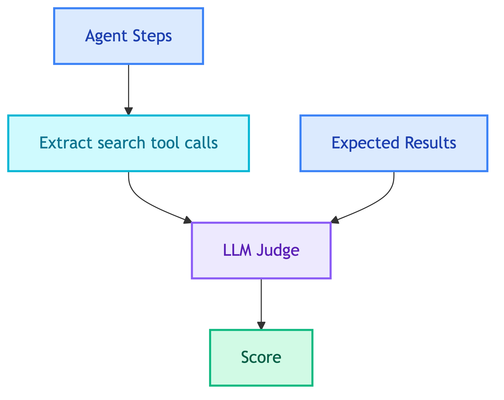

# **🔍 Search Judge**

Evaluates vector search quality.


---


## **📍 Location**

[`evaluation/judges/search/main.py`](../../../evaluation/judges/search/main.py)


---


## **📋 Expected Field**

```yaml
expected_output:
  search_results: ["Wireless Bluetooth Headphones", "Noise Cancelling Headphones"]
```


---


## **📊 Scoring**

| Sub-score | Weight | Description |
|-----------|--------|-------------|
| Relevance | 50% | Are results relevant to query? |
| Coverage | 50% | Are expected products found? |

**Pass threshold**: 0.6


---


## **🔄 Flow**




---


## **❌ Negative Cases**

Use `search_results: "null"` to test that the agent correctly **refuses** to search.

```yaml
# Should not search
expected_output:
  search_results: "null"

# Should return no results
expected_output:
  search_results: []
```

- **Pass**: No search operations found
- **Fail**: Search was executed


### 👤 **Customer Chatbot**

Should refuse or return empty:

| Category | Example | Expected |
|----------|---------|----------|
| Non-existent products | "Do you have flying cars?" | `search_results: "null"` |
| Competitor products | "I want iPhone 15" | `search_results: "null"` |
| Out of scope | "Find me a restaurant nearby" | `search_results: "null"` |

See [`data/eval_datasets/customer/negative/`](../../../data/eval_datasets/customer/negative/) for more examples.


---


## **🔧 Tool Names**

Extracts from these tool calls:
- `product_search`
- `similar_products`


---


## **📝 Prompt**

[search_judge.md](../../prompts/evaluation/judges/search_judge.md)


