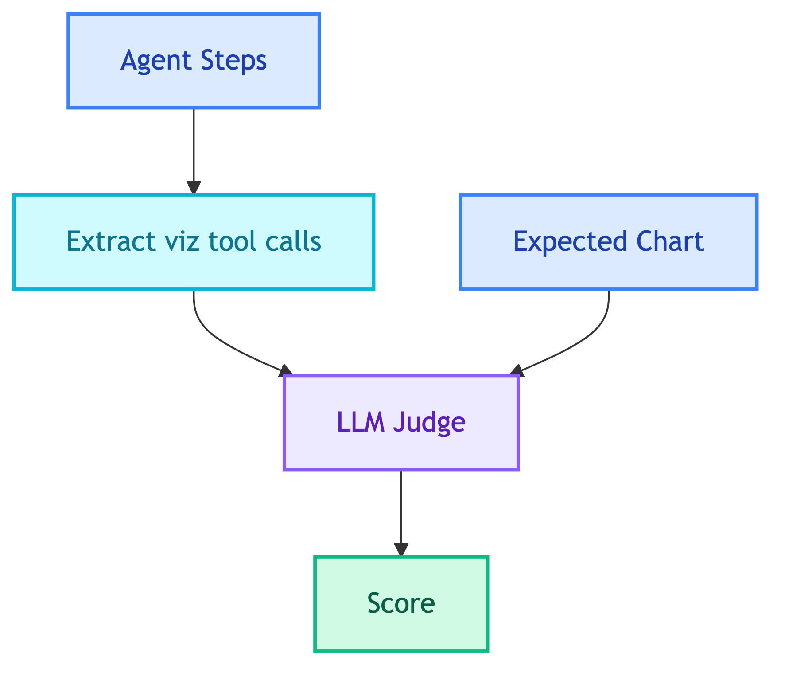

# **📊 Visualization Judge**

Evaluates chart generation quality.


---


## **📍 Location**

[`evaluation/judges/visualization/main.py`](../../../evaluation/judges/visualization/main.py)


---


## **📋 Expected Fields**

```yaml
expected_output:
  has_chart: true
  chart_type: "bar"
```


---


## **📈 Scoring**

| Sub-score | Weight | Description |
|-----------|--------|-------------|
| Appropriateness | 50% | Is chart appropriate for query? |
| Chart Type | 50% | Is chart type correct? |

**Pass threshold**: 0.7


---


## **🔄 Flow**




---


## **❌ Negative Cases**

Use `has_chart: false` to test that the agent correctly **skips** chart generation.

```yaml
expected_output:
  has_chart: false
```

- **Pass**: No visualization created
- **Fail**: Chart was generated


### 💼 **Client Chatbot**

Should NOT create charts for:

| Category | Example |
|----------|---------|
| Simple counts | "How many products are there?" |
| Single values | "What is the total revenue?" |
| Text answers | "What is the most expensive product?" |
| List queries | "List all categories" |

Charts are appropriate for:
- Comparisons ("Sales by category")
- Trends ("Monthly revenue over time")
- Distributions ("Order status breakdown")

See [`data/eval_datasets/client/visualizations/single_turn/no_chart.yaml`](../../../data/eval_datasets/client/visualizations/single_turn/no_chart.yaml) for more examples.


---


## **🔧 Tool Names**

Extracts from these tool calls:
- `create_visualization`
- `create_chart`


---


## **📝 Prompt**

[visualization_judge.md](../../prompts/evaluation/judges/visualization_judge.md)


