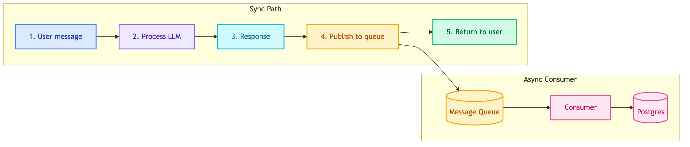
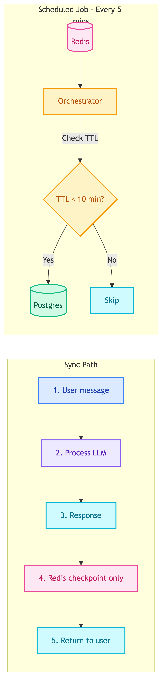

# **⚡ Async Store Writes**

---

## **❌ Problem**

Current implementation writes to PostgreSQL store **synchronously on every turn**, causing:

1. **High I/O load** - Every message = 1 INSERT query
2. **Increased latency** - User waits for DB write before response
3. **Connection pressure** - Concurrent users = concurrent connections
4. **Failure risk** - DB failure blocks chat response

---

## **🔄 Current Flow**

**Problem**: Step 4 blocks step 5. User waits for DB write.

---

## **💡 Proposed Solutions**

### 1️⃣ **Option 1: Message Queue (Real-time)**

Use message queue for immediate async writes on every turn.

| Tool | Description |
|------|-------------|
| Kafka | Distributed event streaming, high-throughput |
| RabbitMQ | Traditional message broker, reliable delivery |

**Pros:**
- Real-time persistence
- No data loss risk
- Decoupled architecture

**Cons:**
- Still writes every turn (high I/O)
- Additional infrastructure

### 2️⃣ **Option 2: Workflow Orchestrator (Scheduled TTL-based)**

Use workflow orchestrator to trigger every 5 mins, check Redis TTL, save only when conversation is ending.

📊 Option 2: Workflow Orchestrator (Scheduled TTL-based)

| Tool | Description |
|------|-------------|
| Airflow | Batch-oriented DAG scheduler, market leader |
| Flyte | Kubernetes-native, type-safe workflows |

**Logic:**
1. Scheduled job runs every 5 minutes
2. Scan Redis keys for checkpoints
3. Check TTL of each key
4. If TTL < 10 minutes → conversation likely ending → save to Postgres
5. If TTL > 10 minutes → user still active → skip

**Pros:**
- Drastically reduces Postgres writes
- Only saves completed/ending conversations
- Batch-friendly (bulk insert)

**Cons:**
- Up to 5 min delay for persistence
- Slightly more complex logic

---

## **⚖️ Comparison**

| Aspect | Queue (Real-time) | Orchestrator (Scheduled) |
|--------|-------------------|--------------------------|
| Write frequency | Every turn | Only when TTL low |
| Postgres I/O | High | Low |
| Data freshness | Immediate | Up to 5 min delay |
| Complexity | Low | Medium |

---

## **✅ Recommendation**

**Option 2: Workflow Orchestrator** is recommended because:

1. **Reduces I/O significantly** - Only writes when conversation is ending
2. **Smarter persistence** - Active conversations don't need immediate backup
3. **Batch-friendly** - Can bulk insert multiple conversations per run

---

## **🔗 References**

- [Apache Kafka](https://kafka.apache.org/)
- [RabbitMQ](https://www.rabbitmq.com/)
- [Apache Airflow](https://airflow.apache.org/)
- [Flyte](https://flyte.org/)
