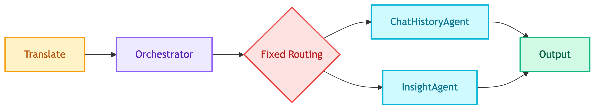
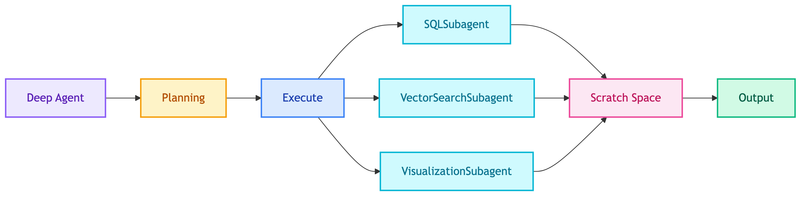

# **🤖 Deep Agents Integration Plan**

Integrating [LangChain Deep Agents](https://github.com/langchain-ai/deepagents) patterns into the MTL Agent system.

---

## **📋 What are Deep Agents?**

Deep agents are AI systems designed to **plan and execute complex tasks over extended timeframes**, moving beyond "shallow" agents that struggle with multi-step operations.

| Regular Agents | Deep Agents |
|----------------|-------------|
| Simple LLM-tool loop | Complex planning + execution |
| Limited task complexity | Multi-step, extended operations |
| Shallow execution | Deep contextual reasoning |

---

## **🧩 Key Components**

| Component | Description |
|-----------|-------------|
| **Detailed System Prompt** | Comprehensive instructions with few-shot examples (like Claude Code) |
| **Planning Tool** | Todo list to maintain task focus - serves as context engineering |
| **Sub-agents** | Specialized agents for individual tasks with focused context |
| **File System Access** | Shared workspace for notes, context, and working memory |

---

## **🔄 Deep Agents vs Context Engineering**

| Aspect | Deep Agents | Context Engineering |
|--------|-------------|---------------------|
| Question | "What should I do?" | "How do I manage memory?" |
| Focus | Planning & delegation | Context window management |

**Example - Client Chatbot Query**: "Show top 5 customers with order trends and chart"

| Step | Deep Agents handles | Context Engineering handles |
|------|---------------------|----------------------------|
| 1 | Plan: break into 3 steps (query → analyze → visualize) | - |
| 2 | Spawn sql-analyst subagent | - |
| 3 | - | Save large SQL result to scratchpad (not in messages) |
| 4 | Spawn visualizer subagent | Select only relevant data from scratchpad |
| 5 | - | Compress old messages before next turn |

**Summary**: Deep Agents decides *what to do*, Context Engineering manages *memory while doing it*.

See [Context Engineering](context_engineering.md) for memory techniques.

---

## **❓ Why Deep Agents?**

Current system uses simple ReAct agents that struggle with:
- Multi-step analytics queries
- Context accumulation over long conversations
- Dynamic task delegation

Deep Agents solve these with: **Planning**, **Subagents**, and **Scratch Space**.

---

## **🏗️ Current vs. Deep Agents Architecture (Client Chatbot)**

### Current Architecture (Fixed Graph)

### Deep Agents Architecture (Dynamic)

## **🔗 References**

- [Deep Agents GitHub](https://github.com/langchain-ai/deepagents)
- [LangChain Blog: Deep Agents](https://blog.langchain.com/deep-agents/)
- [Deep Agents Overview](https://docs.langchain.com/oss/python/deepagents/overview)
