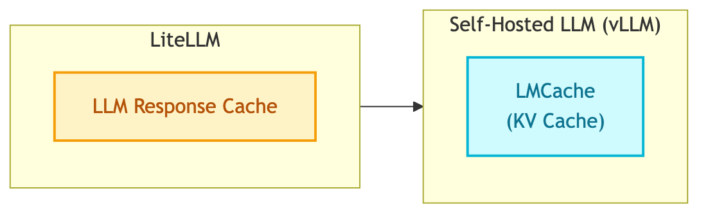

# **⚡ Caching Strategy**

Two-layer caching architecture for LLM applications.



---

## **🆚 Caching vs Memory**

| Concept | Purpose | Example |
|---------|---------|---------|
| **Caching** | Avoid recomputation, reduce latency/cost | LLM response cache |
| **Memory** | Maintain state across turns | Checkpointer (Redis) |

This document covers **caching only**. For memory, see [Why Checkpointer and Store](../../decisions/why_checkpointer_and_store.md).

---

## **📊 Caching Layers Overview**

| Layer | Technology | What's Cached | Benefit |
|-------|------------|---------------|---------|
| **LLM Response Cache** | LiteLLM + Redis | API responses | Avoid duplicate LLM calls |
| **KV Cache** | LMCache (vLLM) | Model computation | Faster inference (self-hosted) |

---

## **1️⃣ LiteLLM Response Caching**

Cache exact LLM responses to avoid duplicate API calls.

### Configuration

```yaml
# configs/litellm/proxy_config.yaml
litellm_settings:
  cache: True
  cache_params:
    type: "redis"
    host: "${REDIS_HOST}"
    port: ${REDIS_PORT}
    password: "${REDIS_PASSWORD}"
    ttl: 3600  # 1 hour
    namespace: "litellm.cache"
```

### 📋 **Cache Types**

**Exact Match**

| Type | Config | Use Case |
|------|--------|----------|
| `local` | In-memory | Development, single process |
| `redis` | Distributed | Production, multi-server |
| `s3` | AWS S3 | Persistent cloud cache |
| `gcs` | Google Cloud Storage | GCP deployment |
| `azure` | Azure Blob Storage | Azure deployment |
| `disk` | Local disk | Large responses, offline |

**Semantic**

| Type | Config | Use Case |
|------|--------|----------|
| `redis-semantic` | Redis + Embeddings | Similar prompts |
| `qdrant-semantic` | Qdrant vector DB | Similar prompts |

---

## **2️⃣ LMCache (KV Cache for vLLM)**

For self-hosted LLM with vLLM, LMCache caches model computation (KV cache).

### 🆚 **LMCache vs LiteLLM Caching**

| Feature | LMCache | LiteLLM Caching |
|---------|---------|-----------------|
| **Cache level** | KV cache (model computation) | API response |
| **What's cached** | Internal key-value pairs after prefill | Complete API responses |
| **Purpose** | Reduce GPU computation, lower TTFT | Avoid duplicate API calls |
| **Storage** | GPU, CPU DRAM, Local Disk | In-memory, Redis, S3 |
| **Performance** | 3-15x throughput improvement | Reduced API costs |
| **Use case** | Self-hosted inference optimization | API gateway caching |

### ✅ **When to Use Each**

- **LMCache**: Self-hosted vLLM deployment - caches at inference engine level
- **LiteLLM Cache**: API proxy - caches responses from LLM providers

### ✨ **LMCache Benefits**

- Reuses KV caches across GPU, CPU DRAM, and disk
- 3-10x latency reduction for multi-round QA and RAG
- Up to 15x throughput improvement
- CacheBlend: compose multiple KV caches together

### ⚙️ **Configuration**

```yaml
# vLLM with LMCache
vllm_args:
  - --enable-lmcache
  - --lmcache-config-file=/config/lmcache.yaml
```

```yaml
# lmcache.yaml
chunk_size: 256
local_device: "cuda"
remote_url: "redis://redis:6379"
remote_serde: "cachegen"
```

---

## **⏱️ TTL Guidelines**

| Cache Type | Recommended TTL | Reason |
|------------|-----------------|--------|
| LLM responses | 1-24 hours | Stable knowledge |
| Embeddings | 24+ hours | Text rarely changes |

---

## **🔗 References**

- [LiteLLM Caching](https://docs.litellm.ai/docs/caching/all_caches)
- [LMCache](https://github.com/LMCache/LMCache)
- [LMCache vLLM Integration](https://docs.vllm.ai/en/latest/examples/others/lmcache/)
