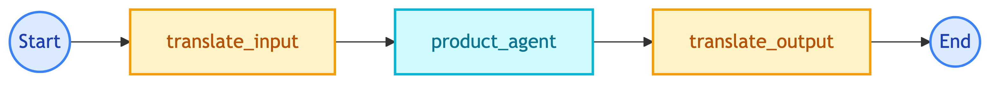
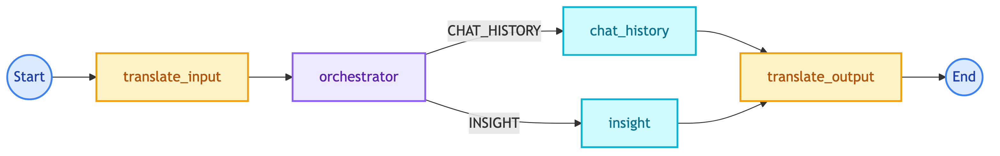

# **📊 Data Science Guide**

Guide for data scientists and prompt engineers who want to understand and improve the chatbot.


---


## **🏗️ System Understanding**

| Topic | Documentation |
|-------|---------------|
| System Overview | [multi-agent-systems/README.md](../multi-agent-systems/README.md) |
| Workflows | [workflows/README.md](../multi-agent-systems/modules/workflows/README.md) |
| Agents | [agents/README.md](../multi-agent-systems/modules/agents/README.md) |
| Tools | [tools/README.md](../multi-agent-systems/modules/tools/README.md) |


---


## **🔄 Chatbot Flows**


### 👤 **Customer Chatbot**



Tools: SQL (product, order, place_order, cancel_order), VectorDB (search, similar)

> 📝 **Note:** Full docs at [Customer Workflow](../multi-agent-systems/modules/workflows/customer_chatbot/main.md)


### 💼 **Client Chatbot**



Tools: SQL (analytics, chat_history), Visualization (charts)

> 📝 **Note:** Full docs at [Client Workflow](../multi-agent-systems/modules/workflows/client_chatbot/main.md)


---


## **📝 Prompts**

| Topic | Documentation |
|-------|---------------|
| Prompt Catalog | [prompts/README.md](../prompts/README.md) |
| Agent Prompts | [prompts/agents/](../prompts/agents/) |
| Tool Prompts | [prompts/tools/](../prompts/tools/) |
| Langfuse Integration | [libs/llm/prompt_manager/langfuse.md](../libs/llm/prompt_manager/langfuse.md) |


### ✏️ **Updating Prompts**

1. Edit prompt in Langfuse dashboard
2. Prompts are fetched at runtime (no deploy needed)
3. Use `prompt_label` in config to pin versions

> 💡 **Tip:** Prompts are hot-reloaded from Langfuse. No deployment required for prompt updates.


---


## **🧪 Evaluation**

| Topic | Documentation |
|-------|---------------|
| Overview | [evaluation/README.md](../evaluation/README.md) |
| Judges | [evaluation/judges/README.md](../evaluation/judges/README.md) |
| Datasets | [evaluation/datasets.md](../evaluation/datasets.md) |
| Examples | [evaluation/examples.md](../evaluation/examples.md) |


### ▶️ **Running Evaluation**

```bash
python scripts/run_eval.py --config configs/evaluation/customer.yaml
python scripts/run_eval.py --config configs/evaluation/client.yaml
```


### ⚖️ **Judges**

| Judge | Purpose |
|-------|---------|
| SQL Judge | Validates SQL query correctness |
| Search Judge | Evaluates vector search quality |
| Visualization Judge | Checks chart generation |
| Response Quality Judge | Measures relevance and faithfulness |
