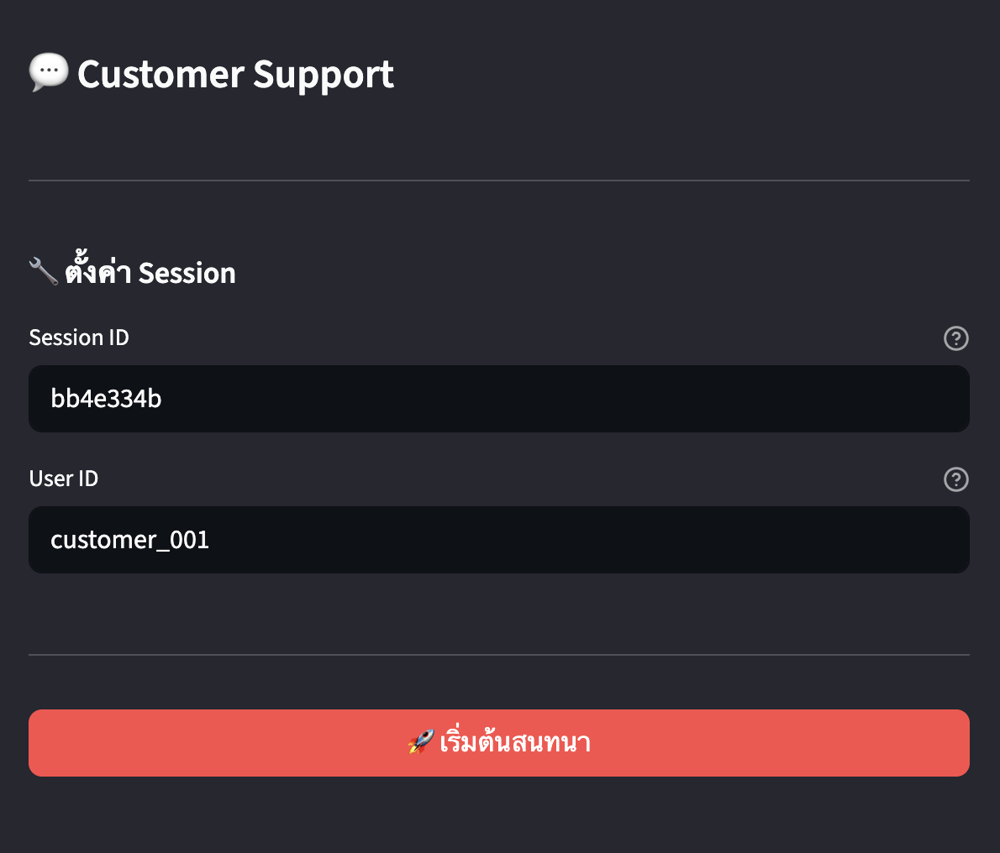
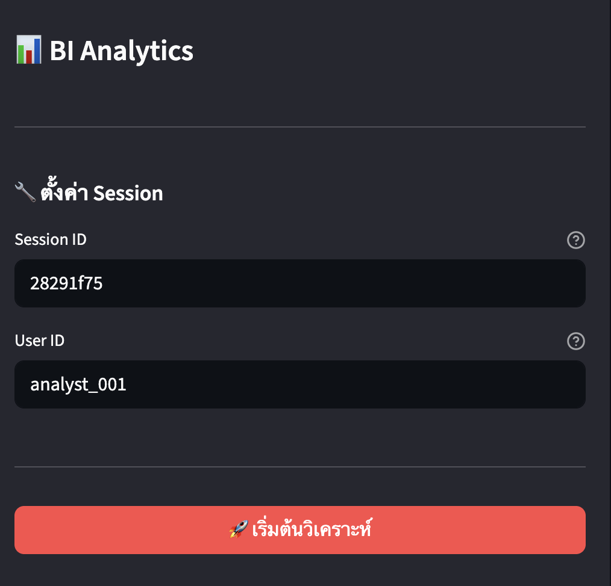

# **👤 Users Guide**

Guide for end users and business users who want to use the chatbot.

| Chatbot | Purpose | Port |
|---------|---------|------|
| Customer Chatbot | Product search, orders, support | 8501 |
| Client Chatbot | BI analytics, reports, visualizations | 8502 |


---


## **🖥️ UI**

### **👤 Customer Chatbot**

**Features**: Product search, stock/price check, place/cancel orders, view orders

**First Steps**: Enter your User ID (1-100) in the sidebar before chatting.



**Example Queries**:
- "Do you have gaming products?"
- "I want to order 2 Gaming Chairs"
- "Cancel my order #123"


### **💼 Client Chatbot**

**Features**: Sales analytics, revenue reports, visualizations, chat history lookup

**First Steps**: Click "New Conversation" in the sidebar to start a new session.



**Example Queries**:
- "Show me this month's sales"
- "Revenue by category as a chart"
- "What did customer 123 ask yesterday?"


---


## **🔗 API**

### **👤 Customer Chatbot**

```bash
curl -X POST http://localhost:8000/api/v1/chatbot/customer/chat \
  -H "Content-Type: application/json" \
  -d '{"query": "Do you have gaming products?", "thread_id": "session-123", "user_id": "15"}'
```

→ See [Customer Chat API](../multi-agent-systems/api/customer_chat.md)


### **💼 Client Chatbot**

```bash
curl -X POST http://localhost:8000/api/v1/chatbot/client/chat \
  -H "Content-Type: application/json" \
  -d '{"query": "Show me this month sales", "thread_id": "session-456"}'
```

→ See [Client Chat API](../multi-agent-systems/api/client_chat.md)
