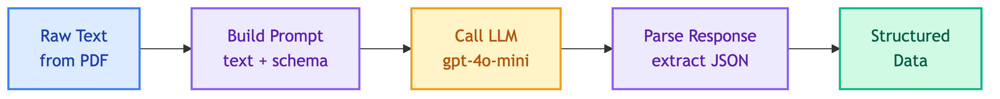

# **⚙️ Ingestor**

Data ingestion pipeline for processing product PDFs into vector embeddings.


---


## **📍 Location**

[`ingestor/`](../../ingestor/)


---


## **🔄 Pipeline Flow**


| Stage | Description | Details |
|-------|-------------|---------|
| Parse | Turn PDF to markdown/text format | PyPDF2 or Docling |
| Extract | Extract structured product data via LLM | gpt-4o-mini |
| Embed | Generate vector embeddings from content | text-embedding-3-small |
| Store | Save embeddings and metadata to Qdrant | With product metadata |


### **🔍 Extraction Flow**




### **📥 Input**

Raw text extracted from PDF.


### **📤 Output**

Data stored in Qdrant with payload containing `product_id`, `product_name`, `source_file`, and `text` (combined description + attributes for semantic search).

```json
{
  "product_name": "Espresso Coffee Maker",
  "description": "Premium espresso machine for home use...",
  "specifications": {
    "product_type": "Coffee Maker",
    "category": "Kitchen Appliances",
    "dimensions": "12 x 8 x 14 inches",
    "weight": "10 lbs"
  },
  "features": [
    {
      "title": "15-Bar Pump",
      "description": "Professional-grade pressure for rich espresso"
    }
  ],
  "summary": "The perfect addition to your kitchen..."
}
```


---


## **🔗 Related**

### **📝 Decisions**

- [Why PyPDF2 Parser](../decisions/why_pypdf2_parser.md) - Why use PyPDF2 for PDF parsing
- [Why LLM Extractor](../decisions/why_llm_extractor.md) - Why use LLM for data extraction
- [Why Flat Text Payload](../decisions/why_flat_text_payload.md) - Why store data as flat text

### **🔮 Future Improvements**

- [Workflow Orchestrator](../future_improvements/ingestion/workflow_orchestrator.md) - Production enhancements
- [Embedding Models](../future_improvements/ingestion/embedding_models.md) - Better retrieval accuracy
- [Search Algorithms](../future_improvements/ingestion/search_algorithms.md) - Hybrid search
- [Structured Payload](../future_improvements/ingestion/structured_payload.md) - Structured vs flat text


---


## **📦 Submodules**

| | |
|:---:|:---:|
| [📄 **Product PDFs**](product-pdfs.md)<br/>100 product detail PDF files | [🔍 **Extractor**](extractor/README.md)<br/>LLM-based structured data extraction |
| [🔄 **Pipeline**](pipeline.md)<br/>Orchestration of parse → extract → embed → store | |


---


## **🏗️ Architecture**

```text
ingestor/
├── pipeline.py         # Main ingestion pipeline
└── extractor/          # LLM extraction providers
    ├── base.py         # BaseExtractor abstract class
    ├── selector.py     # ExtractorSelector
    └── litellm/        # LiteLLM provider
        └── main.py
```


---


## **🔌 Dependencies**

> ⚠️ **Important:** Langfuse prompts must be uploaded before running ingestion.

Prompts are retrieved from Langfuse at runtime. Ensure the `ingestor_extract_product` prompt is uploaded. See [Prompts Documentation](../prompts/README.md).


---


## **⚙️ Configuration**

**Location**: `configs/ingestor/settings.yaml`

```yaml
ingestor:
  parser: pypdf2           # pypdf2 | docling
  pdf_dir: data/product_details
  batch_size: 10

  qdrant:
    host: localhost
    port: 6333
    collection: products
    vector_size: 1536

  llm:
    proxy_url: http://localhost:4000
    api_key: "@format {env[LITELLM_MASTER_KEY]}"
    completion_model: gpt-4o-mini
    embedding_model: text-embedding-3-small

  prompts:
    extractor:
      name: ingestor_extract_product
      label: latest
```


### 🔧 **Options**

| Key | Description | Default |
|-----|-------------|---------|
| `ingestor.parser` | PDF parser (`pypdf2`, `docling`) | `pypdf2` |
| `ingestor.pdf_dir` | PDF source directory | `data/product_details` |
| `ingestor.batch_size` | Embedding batch size | `10` |
| `ingestor.qdrant.host` | Qdrant hostname | `localhost` |
| `ingestor.qdrant.port` | Qdrant port | `6333` |
| `ingestor.qdrant.collection` | Collection name | `products` |
| `ingestor.qdrant.vector_size` | Vector dimension | `1536` |
| `ingestor.llm.proxy_url` | LiteLLM proxy URL | `http://localhost:4000` |
| `ingestor.llm.api_key` | LiteLLM API key | From `LITELLM_MASTER_KEY` |
| `ingestor.llm.completion_model` | Extraction model | `gpt-4o-mini` |
| `ingestor.llm.embedding_model` | Embedding model | `text-embedding-3-small` |
| `ingestor.prompts.extractor.name` | Langfuse prompt name | `ingestor_extract_product` |
| `ingestor.prompts.extractor.label` | Prompt label | `latest` |


### 🌍 **Environment Overrides**

```bash
INGESTOR__PARSER=pypdf2 python scripts/ingest_pdfs.py
```


---


## **▶️ Script**

**Location**: `scripts/ingest_pdfs.py`

```bash
python scripts/ingest_pdfs.py
```
