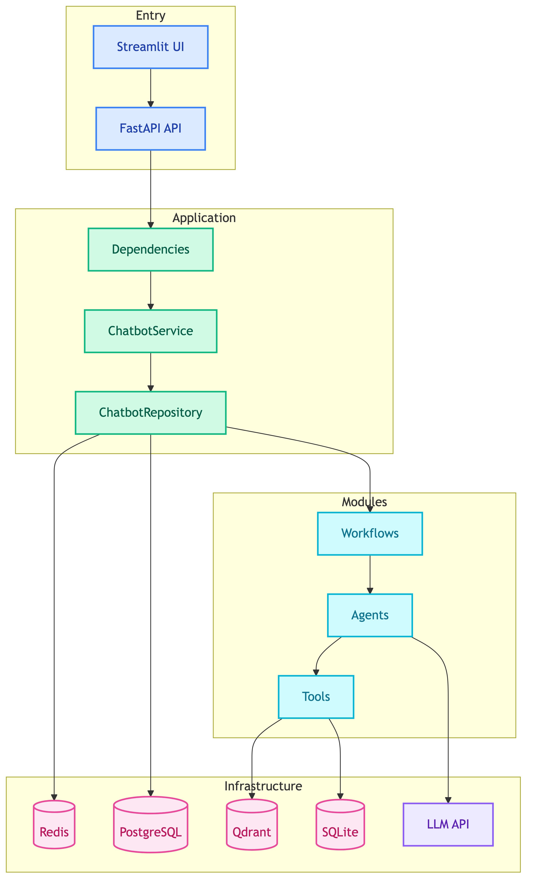
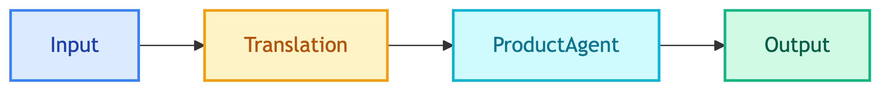

# **🤖 Multi-Agent Systems**

Documentation for the MTL Agent multi-agent chatbot system.


---


## **📋 Overview**

Two LangGraph-based chatbot workflows:

| Chatbot | Target Users | Purpose |
|---------|--------------|---------|
| **Customer Chatbot** | External (shoppers) | Product search, orders, support |
| **Client Chatbot** | Internal (BI analysts) | Analytics, insights, visualization |


---


## **📖 Documentation**

| | | |
|:---:|:---:|:---:|
| [🏗️ **Architecture**](architecture/README.md)<br/>Code and system architecture | [🔄 **Modules**](modules/README.md)<br/>Workflows, agents, tools | [🗄️ **Repositories**](repositories/README.md)<br/>Data access layer |
| [💼 **Usecases**](usecases/README.md)<br/>Business orchestration | [🔌 **Dependencies**](dependencies/README.md)<br/>Dependency injection | [⚙️ **Configs**](configs/README.md)<br/>Configuration files |
| [🔗 **API**](api/README.md)<br/>REST API endpoints | [🖥️ **UI**](ui/README.md)<br/>Streamlit web interfaces | [⌨️ **CLI**](cli/README.md)<br/>Command-line interface |


---


## **🏗️ System Architecture**

<details>
<summary>📊 System Architecture</summary>



</details>


---


## **🔄 Chatbot Workflows**


### 👤 **Customer Chatbot**



**Tools**: SQL (product, order), VectorDB (search, similar)


### 📊 **Client Chatbot**


**Tools**: SQL (analytics, chat_history), Visualization (charts)


---


## **🗄️ Databases**

See [Infrastructure Databases](../database/README.md) for database documentation.


---


## **🚀 Quick Start**

```bash
# Start API server
python main.py api

# Start Customer UI
python main.py customer_ui

# Start Client UI
python main.py client_ui
```


---


## **📝 Design Decisions**

| Decision | Description | Applies To | Link |
|----------|-------------|------------|------|
| ReAct & LangGraph | When to use ReAct agents vs LangGraph workflows | All agents, workflows | [why_react_and_langgraph.md](../decisions/why_react_and_langgraph.md) |
| Checkpointer + Store | Redis for short-term, Postgres for long-term memory | All workflows | [why_checkpointer_and_store.md](../decisions/why_checkpointer_and_store.md) |
| OpenAI Model | Model selection rationale | All agents | [why_openai_model.md](../decisions/why_openai_model.md) |
| LiteLLM | Centralized LLM gateway | All agents | [why_litellm.md](../decisions/why_litellm.md) |
| Langfuse | Observability and prompt management | All agents, tools | [why_langfuse.md](../decisions/why_langfuse.md) |


---


## **🔮 Future Improvements**

| Improvement | Description | Improves | Link |
|-------------|-------------|----------|------|
| Embedding Models | Better semantic search | ProductAgent, VectorDB tools | [embedding_models.md](../future_improvements/ingestion/embedding_models.md) |
| Search Algorithms | Hybrid search strategies | ProductAgent, VectorDB tools | [search_algorithms.md](../future_improvements/ingestion/search_algorithms.md) |
| Structured Payload | Type-safe tool outputs | All tools | [structured_payload.md](../future_improvements/ingestion/structured_payload.md) |
| Context Engineering | Managing LLM context windows | All agents | [context_engineering.md](../future_improvements/context_engineering.md) |
| Deep Agents Integration | LangChain Deep Agents patterns | All workflows | [deep_agents_integration.md](../future_improvements/deep_agents_integration.md) |
| Caching Strategy | LiteLLM, semantic cache, embedding cache | All agents | [caching.md](../future_improvements/infrastructure/caching.md) |
| Self-Hosted LLM | vLLM, Ollama deployment | All agents | [self_hosted_llm.md](../future_improvements/infrastructure/self_hosted_llm.md) |
| Async Store Writes | Non-blocking memory persistence | All workflows | [async_store_writes.md](../future_improvements/chat_history/async_store_writes.md) |
