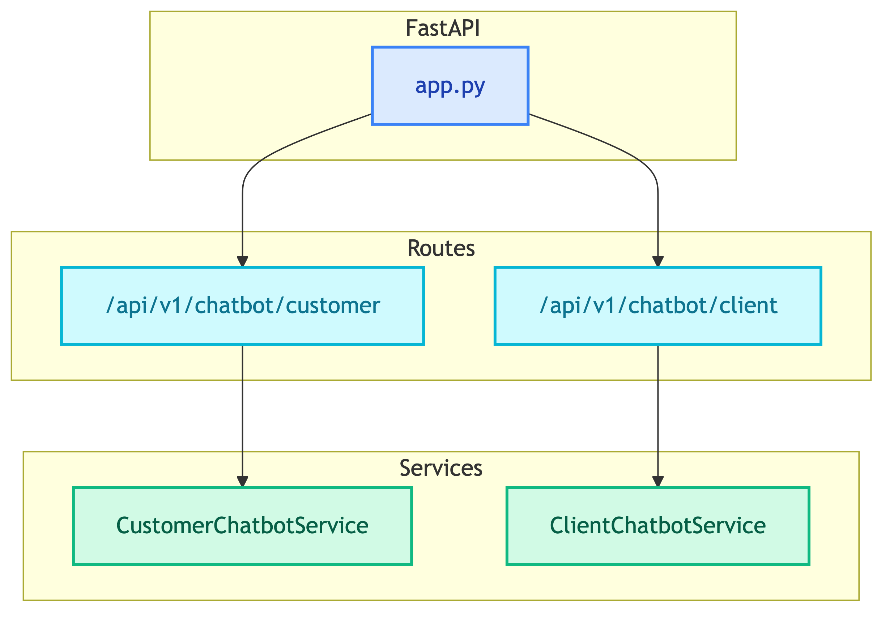
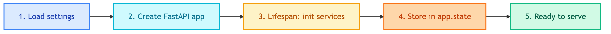

# **🔗 API**

REST API layer for multi-agent chatbots.


---


## **📍 Location**

[`src/api/`](../../../src/api/)


---


## **📋 Overview**




---


## **🔌 Endpoints**

| | |
|:---:|:---:|
| [👤 **/api/v1/chatbot/customer/chat**](customer_chat.md)<br/>POST - Customer chatbot | [💼 **/api/v1/chatbot/client/chat**](client_chat.md)<br/>POST - Client chatbot |
| ✅ **/health**<br/>GET - Health check | |


---


## **📂 File Structure**

```
src/api/
├── app.py                          # FastAPI application factory
├── routes/
│   ├── health.py                   # Health check endpoint
│   └── chatbots/
│       ├── customer.py             # Customer chatbot routes
│       └── client.py               # Client chatbot routes
└── schemas/
    └── chatbots/
        ├── customer.py             # Customer request/response models
        └── client.py               # Client request/response models
```


---


## **🔄 Application Lifecycle**




---


## **💉 Service Injection**

Services are initialized in `lifespan` and stored in `app.state`:

```python
@asynccontextmanager
async def lifespan(app: FastAPI):
    app.state.customer_chatbot_service = build_chatbot_service()
    app.state.client_chatbot_service = build_client_chatbot_service()
    yield
```


