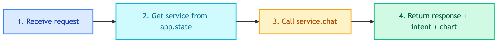

# **📊 POST /api/v1/chatbot/client/chat**

Client chatbot endpoint for internal BI queries.


---


## **📍 Location**

[`src/api/routes/chatbots/client.py`](../../../src/api/routes/chatbots/client.py)


---


## **🔄 Code Flow**




---


## **📥 Request Schema**

`src/api/schemas/chatbots/client.py`

| Field | Type | Required | Default | Description |
|-------|------|----------|---------|-------------|
| query | string | Yes | - | User message (Thai or English) |
| thread_id | string | Yes | - | Conversation thread ID |
| user_id | string | No | None | User identifier |
| include_steps | bool | No | false | Include tool execution steps |


---


## **📤 Response Schema**

| Field | Type | Description |
|-------|------|-------------|
| response | string | Chatbot response |
| thread_id | string | Conversation thread ID |
| intent | string | Detected intent (`chat_history` or `insight`) |
| chart_html | string | Plotly chart HTML (if visualization) |
| steps | list[dict] | Tool execution steps (if requested) |

> 💡 **Why `intent`?** The UI displays the detected intent as a badge to show users which type of query was processed:
> ```python
> if message.get("intent"):
>     st.caption(f"📊 Intent: {message['intent']}")
> ```


---


## **💡 Example**


### 📤 **Request**

```bash
curl -X POST http://localhost:8000/api/v1/chatbot/client/chat \
  -H "Content-Type: application/json" \
  -d '{
    "query": "ยอดขายเดือนนี้แยกตาม category",
    "thread_id": "thread-456",
    "user_id": "user-789"
  }'
```


### 📥 **Response**

```json
{
  "response": "ยอดขายเดือนนี้แยกตาม category:\n- Electronics: ฿1.2M\n- ...",
  "thread_id": "thread-456",
  "intent": "insight",
  "chart_html": "<div id='plotly'>...</div>",
  "steps": null
}
```


---


## **❌ Errors**

| Status | Description |
|--------|-------------|
| 500 | Internal server error |


