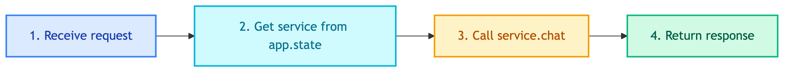

# **🛒 POST /api/v1/chatbot/customer/chat**

Customer chatbot endpoint for product inquiries.


---


## **📍 Location**

[`src/api/routes/chatbots/customer.py`](../../../src/api/routes/chatbots/customer.py)


---


## **🔄 Code Flow**




---


## **📥 Request Schema**

`src/api/schemas/chatbots/customer.py`

| Field | Type | Required | Default | Description |
|-------|------|----------|---------|-------------|
| query | string | Yes | - | User message |
| thread_id | string | Yes | - | Conversation thread ID |
| user_id | string | No | None | User identifier |
| include_steps | bool | No | false | Include tool execution steps |


---


## **📤 Response Schema**

| Field | Type | Description |
|-------|------|-------------|
| response | string | Chatbot response |
| thread_id | string | Conversation thread ID |
| steps | list[dict] | Tool execution steps (if requested) |


---


## **💡 Example**


### 📤 **Request**

```bash
curl -X POST http://localhost:8000/api/v1/chatbot/customer/chat \
  -H "Content-Type: application/json" \
  -d '{
    "query": "หาลำโพง bluetooth",
    "thread_id": "thread-123",
    "user_id": "user-456"
  }'
```


### 📥 **Response**

```json
{
  "response": "พบลำโพง bluetooth 5 รายการ:\n1. JBL Flip 6 - ฿3,990\n2. ...",
  "thread_id": "thread-123",
  "steps": null
}
```


---


## **❌ Errors**

| Status | Description |
|--------|-------------|
| 500 | Internal server error |


