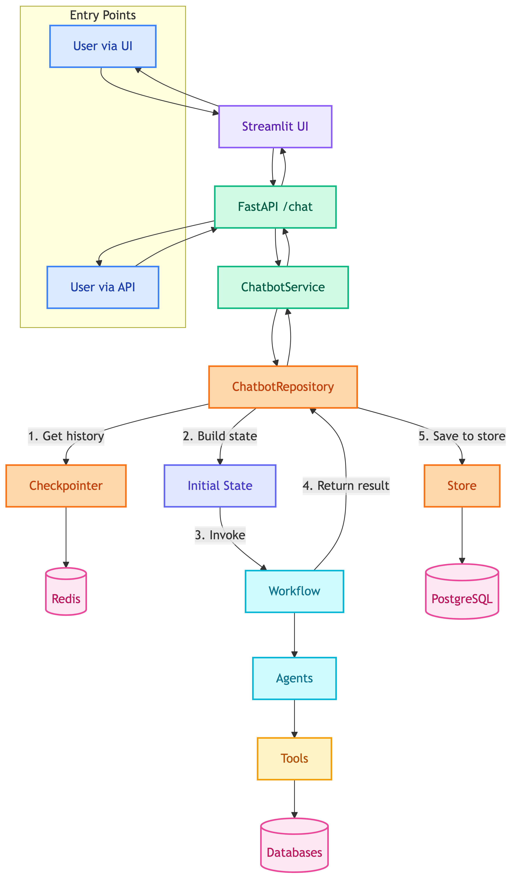
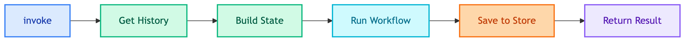
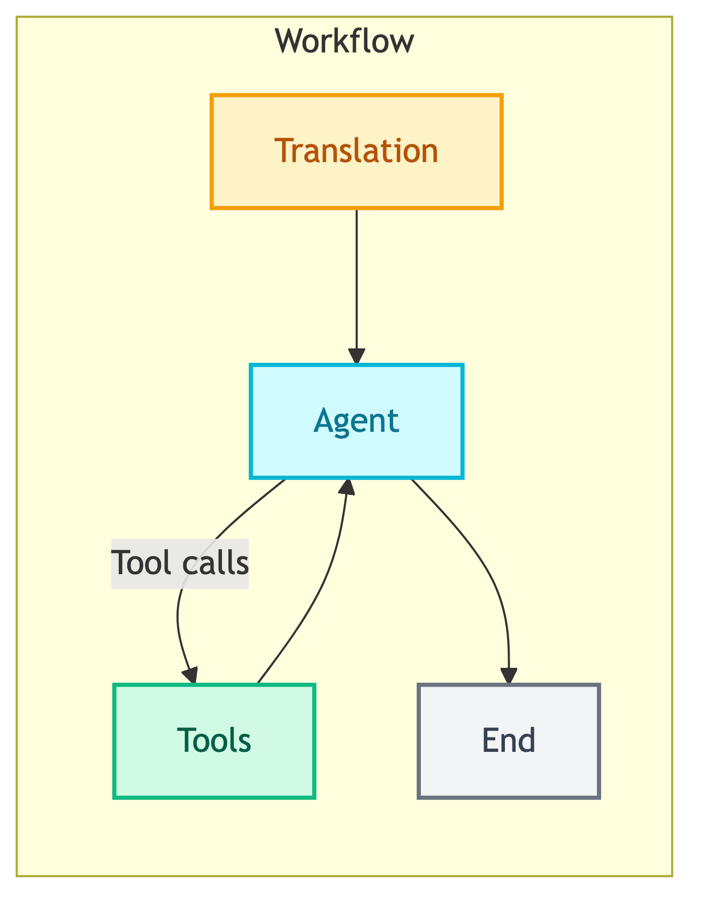
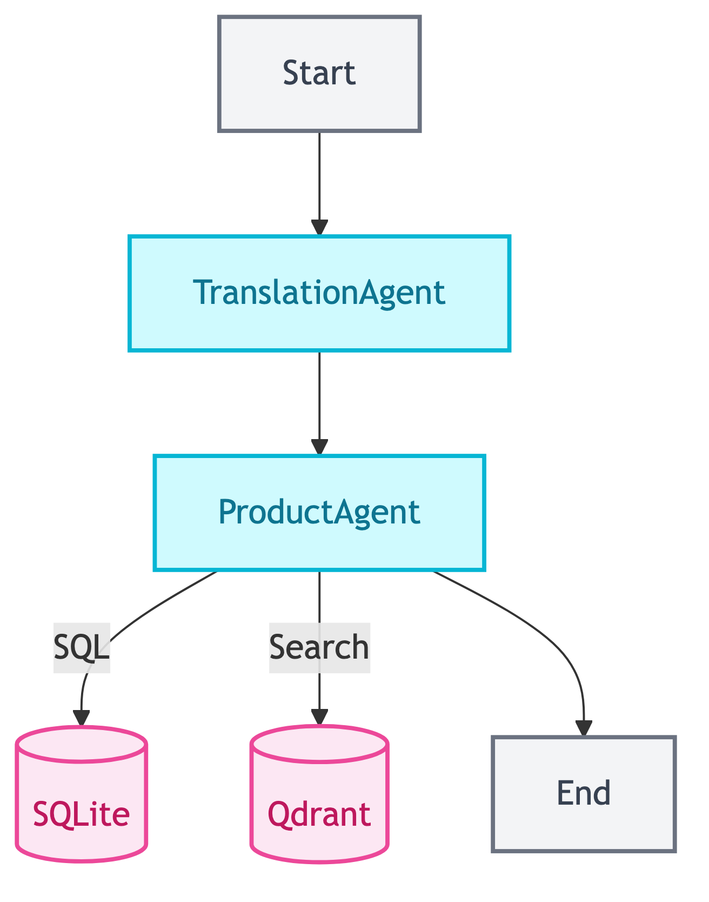

# **🔄 System Architecture**

Request lifecycle from user to response.


---


## **🔄 Request Flow**

High-level overview of how a request travels through the system.

<details>
<summary>📊 Request Flow</summary>



</details>


---


## **🚪 Entry Points**

Two ways users can interact with the system.

| Entry | Path | Use Case |
|-------|------|----------|
| UI | User → Streamlit → API | Interactive chat interface |
| API | User → API directly | Integration, testing, automation |


---


## **📋 Step-by-Step Flow**

Detailed breakdown of each stage in the request lifecycle.

### 1️⃣ **User Request**

**Via UI:**
```
User → Streamlit UI → POST /api/v1/chatbot/{type}/chat
```

**Via API:**
```
User → POST /api/v1/chatbot/{type}/chat
```

| Step | Component | Action |
|------|-----------|--------|
| 1 | Entry | User sends message (UI or API) |
| 2 | API | Route handler receives request |
| 3 | API | Calls `ChatbotService.chat()` |


### 2️⃣ **Repository Processing**

```
ChatbotService → ChatbotRepository.invoke()
```



| Step | Method | Action |
|------|--------|--------|
| 1 | `get_history()` | Fetch messages from Redis checkpointer |
| 2 | Build state | Create initial state with query + history |
| 3 | `app.invoke()` | Run compiled workflow |
| 4 | `_save_to_store()` | Persist to PostgreSQL store |


### 3️⃣ **Workflow Execution**



| Step | Node | Action |
|------|------|--------|
| 1 | Translation | Detect language, translate if needed |
| 2 | Agent | Process query, decide tool usage |
| 3 | Tools | Execute SQL, VectorDB, Visualization |
| 4 | Agent | Generate final response |


### 4️⃣ **Memory Management**

> 📝 **Note:** See [why_checkpointer_and_store.md](../../decisions/why_checkpointer_and_store.md) for detailed explanation.

| Memory | Storage | TTL | Purpose |
|--------|---------|-----|---------|
| Checkpointer | Redis | 60 min | Per-thread state snapshots |
| Store | PostgreSQL | Permanent | Long-term backup |


### 5️⃣ **Response Return**

**Via UI:**
```
Result → API → Streamlit UI → User
```

**Via API:**
```
Result → API → User
```


---


## **👤 Customer Chatbot Flow**

End-to-end flow for customer-facing chatbot (product search, orders).




---


## **💼 Client Chatbot Flow**

End-to-end flow for internal BI chatbot (analytics, visualizations, chat history lookup).

<details>
<summary>📊 Client Chatbot Flow</summary>


</details>


---


## **📊 State Schema**

Data structure passed through the workflow at each stage.

### 📥 **Initial State (Input)**

| Field | Type | Description |
|-------|------|-------------|
| `messages` | `list[BaseMessage]` | History from checkpointer |
| `query` | `str` | User's question |
| `customer_id` | `str` | User identifier |
| `user_language` | `None` | Detected later |


### 📤 **Final State (Output)**

| Field | Type | Description |
|-------|------|-------------|
| `messages` | `list[BaseMessage]` | Updated history |
| `response` | `str` | Final answer |
| `steps` | `list[dict]` | Execution trace |
| `error` | `str` | Error if any |


---


## **🔗 References**

- [Repositories](../repositories/README.md) - ChatbotRepository details
- [Modules](../modules/README.md) - Workflow and agent details
- [API](../api/README.md) - Endpoint details
