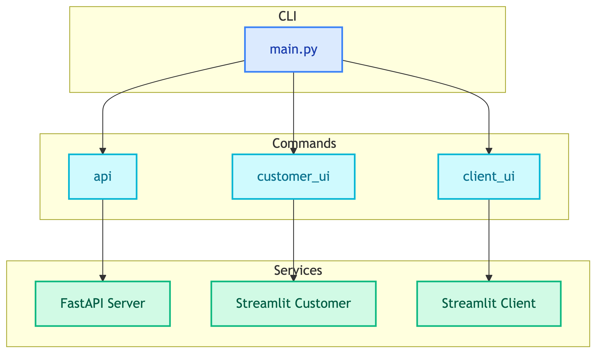

# **⌨️ CLI (main.py)**

Application entry point for running API and UI services.


---


## **📍 Location**

[`main.py`](../../../main.py)


---


## **📋 Overview**




---


## **📦 Commands**

| Command | Default Port | Purpose | Documentation |
|---------|--------------|---------|---------------|
| `api` | 8000 | FastAPI REST API server | [api.md](api.md) |
| `customer_ui` | 8501 | Customer Support Streamlit UI | [customer_ui.md](customer_ui.md) |
| `client_ui` | 8502 | Client BI Analytics Streamlit UI | [client_ui.md](client_ui.md) |


---


## **🚀 Quick Start**

```bash
# Start API server
python main.py api

# Start Customer Support UI
python main.py customer_ui

# Start Client BI Analytics UI
python main.py client_ui
```


---


## **🔄 Initialization Flow**


| Step | Code | Purpose |
|------|------|---------|
| 1 | `load_dotenv()` | Load environment variables |
| 2 | `ConfigSelector.create()` | Load Dynaconf settings |
| 3 | `setup_logging()` | Configure logging level |
| 4 | `typer.Typer()` | Create CLI application |


---


## **🐳 Docker**

When using Docker, services are started via `docker-compose`:

```bash
# Start all services
docker-compose up -d

# Start specific service
docker-compose up -d api
docker-compose up -d customer-ui
docker-compose up -d client-ui
```


---


## **💻 Local Development**

For local development without Docker:

```bash
# Terminal 1: Start API
python main.py api --reload

# Terminal 2: Start Customer UI
python main.py customer_ui

# Terminal 3: Start Client UI
python main.py client_ui
```


