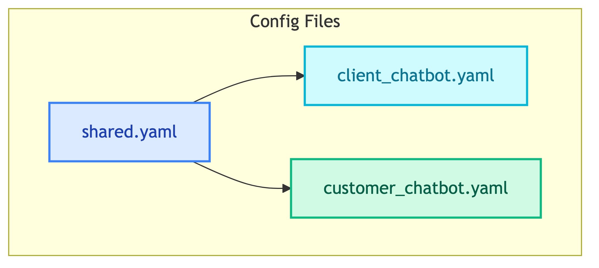

# **⚙️ Configs**

Configuration files for multi-agent chatbots.

---

## **📍 Location**

[`configs/agents/`](../../../configs/agents/)

---

## **📋 Overview**

---

## **📄 Config Files**

| | | |
|:---:|:---:|:---:|
| [🔧 **shared.yaml**](shared.md) Common settings (LLM, observability, databases) | [💼 **client_chatbot.yaml**](client_chatbot.md) Client chatbot agents and tools | [👤 **customer_chatbot.yaml**](customer_chatbot.md) Customer chatbot agents and tools |

---

## **🔗 References**

- [Dynaconf](../../libs/configs/dynaconf.md) - Config library documentation
