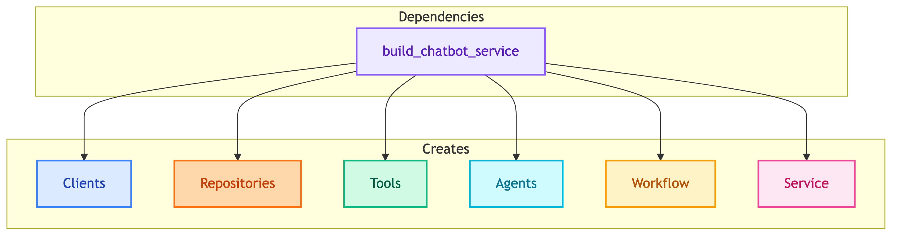

# **💉 Dependencies**

Dependency injection wiring layer.

---

## **📍 Location**

[`src/dependencies/`](../../../src/dependencies/)

---

## **📋 Overview**

Dependencies layer creates and wires all components together. Each file provides a `build_*_service()` function that returns a ready-to-use service.

---

## **📦 Available Dependencies**

| | |
|:---:|:---:|
| [💼 **client_chatbot.py**](client_chatbot.md) `build_client_chatbot_service()` | [👤 **customer_chatbot.py**](customer_chatbot.md) `build_chatbot_service()` |

---

## **⚙️ Config Loading**

Dependencies read from `configs/agents/`:

| Config File | Documentation |
|-------------|---------------|
| shared.yaml | [configs/shared.md](../configs/shared.md) |
| client_chatbot.yaml | [configs/client_chatbot.md](../configs/client_chatbot.md) |
| customer_chatbot.yaml | [configs/customer_chatbot.md](../configs/customer_chatbot.md) |

---

## **🔗 References**

- [Usecases](../usecases/README.md) - Business logic layer
- [Repositories](../repositories/README.md) - Data access layer
