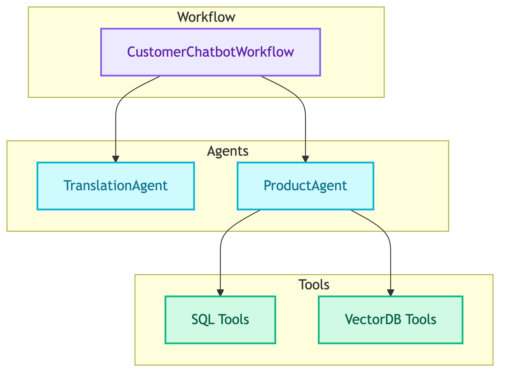
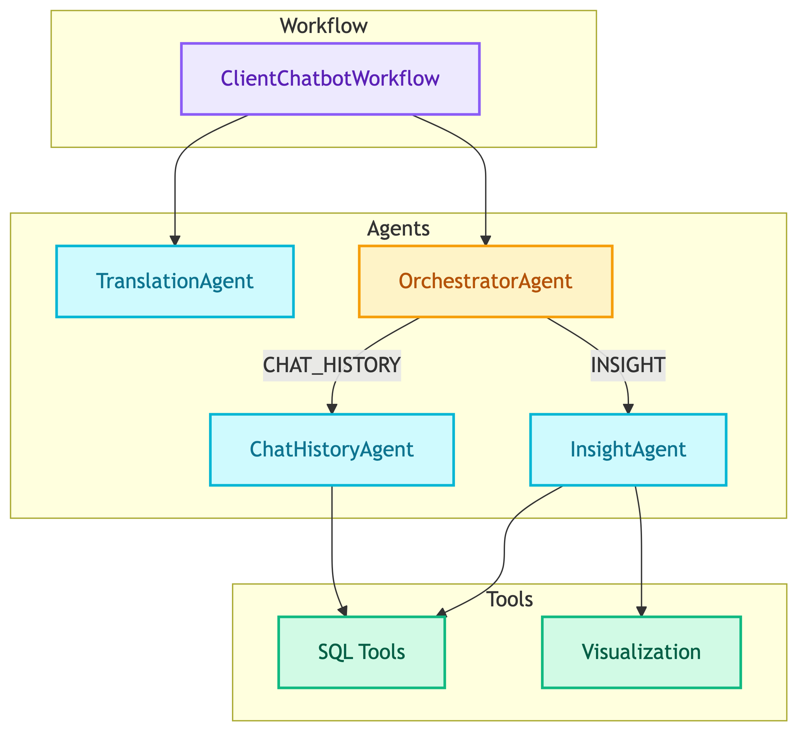

# **📦 Modules**

Core building blocks for multi-agent systems.


---


## **📍 Location**

[`src/modules/`](../../../src/modules/)


---


## **📋 Overview**

Modules are the main components that power the chatbot systems. They follow a layered architecture where workflows orchestrate agents, and agents use tools.


### 👤 **Customer Chatbot Flow**




### 💼 **Client Chatbot Flow**




---


## **🧩 Components**

| | | |
|:---:|:---:|:---:|
| [🔄 **Workflows**](workflows/README.md)<br/>Graph orchestrators | [🤖 **Agents**](agents/README.md)<br/>LLM-powered decision makers | [🔧 **Tools**](tools/README.md)<br/>Domain logic executors |


---


## **📂 File Structure**

```
src/modules/
├── workflows/
│   ├── base.py                    # BaseWorkflow abstract class
│   ├── client_chatbot/            # Client workflow
│   └── customer_chatbot/          # Customer workflow
├── agents/
│   ├── base.py                    # BaseAgent abstract class
│   ├── translation/main.py        # TranslationAgent
│   ├── products/main.py           # ProductAgent
│   └── client/
│       ├── orchestrator.py        # OrchestratorAgent
│       ├── insight.py             # CustomerInsightAgent
│       └── chat_history.py        # CustomerChatHistoryAgent
└── tools/
    ├── knowledge_retrieval/
    │   ├── sql/                   # SQL tools
    │   └── vectordb/              # VectorDB tools
    └── visualization/             # Chart tools
```
