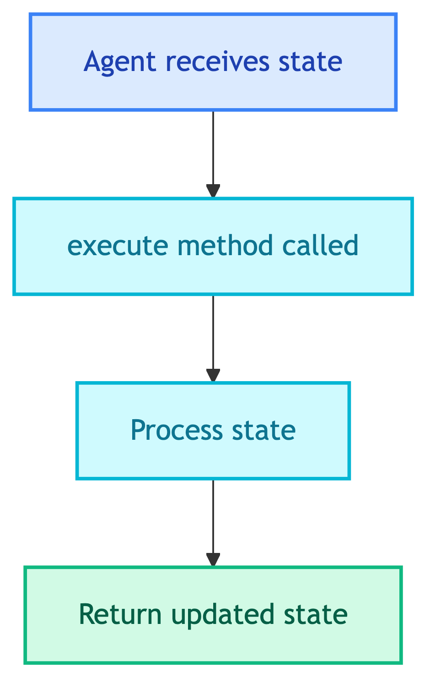

# **🤖 Base Agent**

Abstract base class for all agents.


---


## **📍 Location**

[`src/modules/agents/base.py`](../../../../src/modules/agents/base.py)


---


## **📋 Class: BaseAgent**

Abstract base class (ABC).


### 💡 **Purpose**

Provides common interface and utilities for all agents. All agents inherit from this class.


### 🔧 **Methods**

| Method | Description |
|--------|-------------|
| `execute(state)` | Abstract - process agent state |
| `_build_messages_with_history(query, history)` | Convert LangChain messages to role/content dicts |


### 🔄 **Code Flow**




### 💡 **Usage**

```python
from src.modules.agents.base import BaseAgent

class MyAgent(BaseAgent):
    def __init__(self):
        super().__init__(name="my_agent")
    
    def execute(self, state: dict) -> dict:
        # Process state
        return {"response": "result"}
```


---


### 🔧 **Helper: _build_messages_with_history**

Converts LangChain message objects to list of dicts:

```python
# Input: LangChain messages
[HumanMessage("Hello"), AIMessage("Hi there")]

# Output: role/content dicts
[
    {"role": "user", "content": "Hello"},
    {"role": "assistant", "content": "Hi there"},
    {"role": "user", "content": "<current query>"}
]
```
