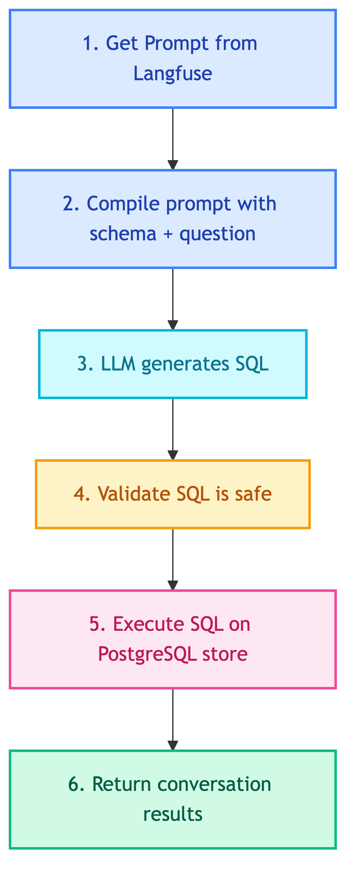

# **💬 Customer Chat History Agent**

ReAct agent for looking up customer chat conversations.


---


## **📍 Location**

[`src/modules/agents/client/chat_history.py`](../../../../../src/modules/agents/client/chat_history.py)


---


## **📜 Prompt**

[chat_history.md](../../../../prompts/agents/client/chat_history.md)


---


## **📋 Class: CustomerChatHistoryAgent**

Inherits from `BaseAgent`.


### 💡 **Purpose**

Look up customer chat history from PostgreSQL LangGraph store. Uses ReAct pattern with SQLTool.


### ⚙️ **Configuration**

| Property | Value |
|----------|-------|
| LLM | ChatOpenAI |
| Pattern | ReAct (LangGraph) |
| Tools | SQLTool (PostgreSQL) |
| Prompt | `client_chatbot_chat_history` |


### 📥 **Input State**

| Field | Type | Description |
|-------|------|-------------|
| `translated_query` | str | Query in English |
| `messages` | list | Conversation history (optional) |


### 📤 **Output State**

| Field | Type | Description |
|-------|------|-------------|
| `response` | str | Chat history results |
| `steps` | list | Tool calls made |


### 🔄 **Code Flow**

<details>
<summary>📊 Code Flow</summary>



</details>


### 💡 **Example Flows**

**Query: "What did customer 123 ask yesterday?"**
```
LLM → SQLTool (query store table) → Response
```

**Query: "Find complaints about shipping"**
```
LLM → SQLTool (search conversations) → Response
```


### 🔧 **Tools**

| Tool | Location | Purpose |
|------|----------|---------|
| ClientChatHistorySQLTool | [sql/client/chat_history.md](../../tools/knowledge_retrieval/sql/client/chat_history.md) | Query PostgreSQL store table |


---


### 💡 **Usage**

```python
from src.modules.agents.client.chat_history import CustomerChatHistoryAgent

agent = CustomerChatHistoryAgent(
    llm=llm,
    prompt_manager=prompt_manager,
    tools=[chat_history_sql_tool],
)

result = agent.execute({"translated_query": "Show customer complaints"})
# Returns: {"response": "...", "steps": [...]}
```
