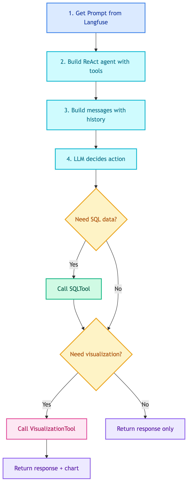

# **📊 Customer Insight Agent**

ReAct agent for BI analytics and visualizations.


---


## **📍 Location**

[`src/modules/agents/client/insight.py`](../../../../../src/modules/agents/client/insight.py)


---


## **📜 Prompt**

[insight.md](../../../../prompts/agents/client/insight.md)


---


## **📋 Class: CustomerInsightAgent**

Inherits from `BaseAgent`.


### 💡 **Purpose**

Analyze business data using SQL queries and create visualizations. Uses ReAct pattern with SQLTool and VisualizationTool.


### ⚙️ **Configuration**

| Property | Value |
|----------|-------|
| LLM | ChatOpenAI |
| Pattern | ReAct (LangGraph) |
| Tools | SQLTool (SQLite), VisualizationTool |
| Prompt | `client_chatbot_insight` |


### 📥 **Input State**

| Field | Type | Description |
|-------|------|-------------|
| `translated_query` | str | Query in English |
| `messages` | list | Conversation history (optional) |


### 📤 **Output State**

| Field | Type | Description |
|-------|------|-------------|
| `response` | str | Analysis results |
| `chart_html` | str | Plotly chart HTML (optional) |
| `steps` | list | Tool calls made |


### 🔄 **Code Flow**

<details>
<summary>📊 Code Flow</summary>



</details>


### 💡 **Example Flows**

**Query: "Top 10 sales this month"**
```
LLM → SQLTool → Response (no chart)
```

**Query: "Show revenue trend as a chart"**
```
LLM → SQLTool → VisualizationTool → Response + Chart
```

**Query: "Compare sales by category with bar chart"**
```
LLM → SQLTool → VisualizationTool → Response + Chart
```


### 🔧 **Tools**

| Tool | Location | Purpose |
|------|----------|---------|
| ClientAnalyticsSQLTool | [sql/client/analytics.md](../../tools/knowledge_retrieval/sql/client/analytics.md) | Query ERP data |
| VisualizationTool | [visualization/main.md](../../tools/visualization/main.md) | Create Plotly charts |


---


### 💡 **Usage**

```python
from src.modules.agents.client.insight import CustomerInsightAgent

agent = CustomerInsightAgent(
    llm=llm,
    prompt_manager=prompt_manager,
    tools=[sql_tool, viz_tool],
)

result = agent.execute({"translated_query": "Show revenue by month"})
# Returns: {"response": "...", "chart_html": "<div>...</div>", "steps": [...]}
```
