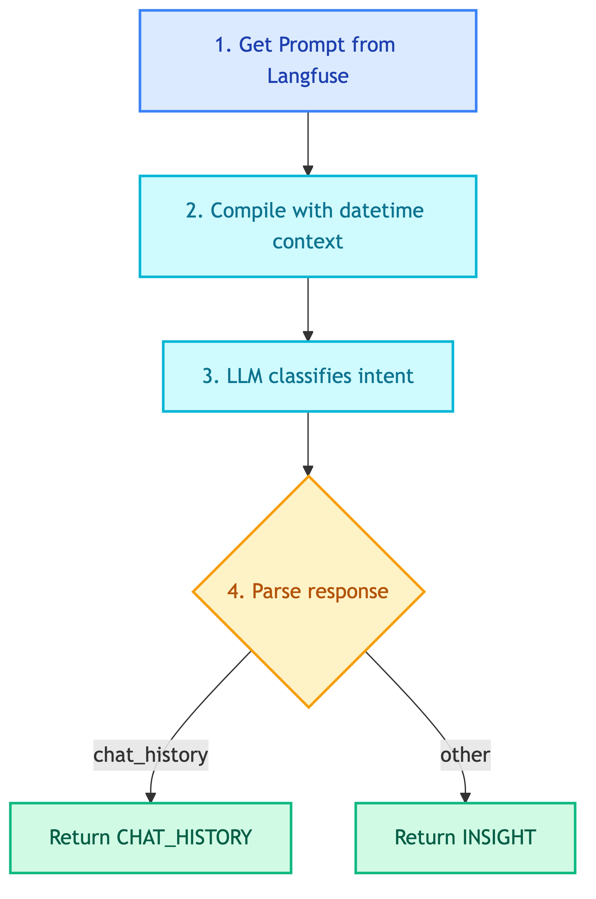

# **🎯 Orchestrator Agent**

Router agent that classifies intent and routes to appropriate agent.


---


## **📍 Location**

[`src/modules/agents/client/orchestrator.py`](../../../../../src/modules/agents/client/orchestrator.py)


---


## **📜 Prompt**

[orchestrator.md](../../../../prompts/agents/client/orchestrator.md)


---


## **📋 Class: OrchestratorAgent**

Inherits from `BaseAgent`.


### 💡 **Purpose**

Classifies user intent and routes to either `chat_history` or `insight` agent.


### ⚙️ **Configuration**

| Property | Value |
|----------|-------|
| LLM | ChatOpenAI |
| Prompt | `client_chatbot_orchestrator` |


### 📥 **Input State**

| Field | Type | Description |
|-------|------|-------------|
| `translated_query` | str | Query in English |


### 📤 **Output State**

| Field | Type | Description |
|-------|------|-------------|
| `intent` | Intent | `CHAT_HISTORY` or `INSIGHT` |


### 🔄 **Code Flow**

<details>
<summary>📊 Code Flow</summary>



</details>


### 🎯 **Intent Types**

| Intent | Description | Routes to |
|--------|-------------|-----------|
| `CHAT_HISTORY` | Looking up customer conversations | ChatHistoryAgent |
| `INSIGHT` | BI analytics / reporting / visualization | InsightAgent |


---


### 💡 **Usage**

```python
from src.modules.agents.client.orchestrator import OrchestratorAgent

agent = OrchestratorAgent(
    llm=llm,
    prompt_manager=prompt_manager,
)

result = agent.execute({"translated_query": "Show me customer complaints"})
# Returns: {"intent": Intent.CHAT_HISTORY}
```
