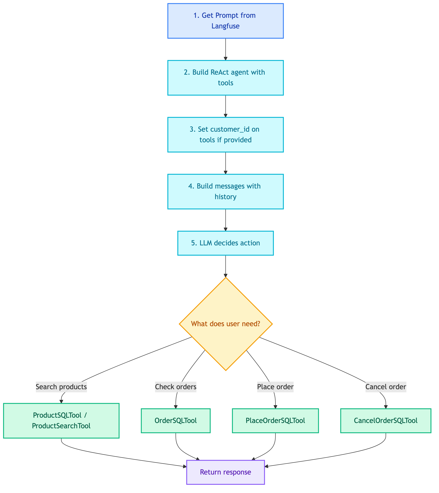

# **🛒 Product Agent**

ReAct agent for handling product-related queries.


---


## **📍 Location**

[`src/modules/agents/products/main.py`](../../../../../src/modules/agents/products/main.py)


---


## **📜 Prompt**

[product_agent.md](../../../../prompts/agents/customer/product_agent.md)


---


## **📋 Class: ProductAgent**

Inherits from `BaseAgent`.


### 💡 **Purpose**

Handle product queries using ReAct pattern. Dynamically decides which tools to use for product search, recommendations, comparisons, stock queries, and order placement.


### ⚙️ **Configuration**

| Property | Value |
|----------|-------|
| LLM | ChatOpenAI |
| Pattern | ReAct (LangGraph) |
| Prompt | `product_agent` |


### 📥 **Input State**

| Field | Type | Description |
|-------|------|-------------|
| `query` | str | User's product query |
| `messages` | list | Conversation history (optional) |
| `customer_id` | str | Customer ID for orders (optional) |


### 📤 **Output State**

| Field | Type | Description |
|-------|------|-------------|
| `response` | str | Agent's response |
| `steps` | list | Tool calls made |


### 🔧 **Tools**

| Tool | Location | Purpose |
|------|----------|---------|
| CustomerProductSQLTool | [sql/customer/product.md](../../tools/knowledge_retrieval/sql/customer/product.md) | Query products and inventory |
| CustomerOrderSQLTool | [sql/customer/order.md](../../tools/knowledge_retrieval/sql/customer/order.md) | Query order history |
| PlaceOrderSQLTool | [sql/customer/place_order.md](../../tools/knowledge_retrieval/sql/customer/place_order.md) | Place new orders |
| CancelOrderSQLTool | [sql/customer/cancel_order.md](../../tools/knowledge_retrieval/sql/customer/cancel_order.md) | Cancel orders |
| ProductSearchTool | [vectordb/search.md](../../tools/knowledge_retrieval/vectordb/search.md) | Semantic product search |
| SimilarProductsTool | [vectordb/similar.md](../../tools/knowledge_retrieval/vectordb/similar.md) | Find similar products |


### 🔄 **Code Flow**

<details>
<summary>📊 Code Flow</summary>



</details>


### 💡 **Example Flows**

**Query: "Show me laptops under $1000"**
```
LLM → ProductSQLTool → Response
```

**Query: "I want to order product 5"**
```
LLM → PlaceOrderSQLTool (confirm) → PlaceOrderSQLTool (execute) → Response
```

**Query: "What's my order status?"**
```
LLM → OrderSQLTool → Response
```


---


### 💡 **Usage**

```python
from src.modules.agents.products.main import ProductAgent

agent = ProductAgent(
    llm=llm,
    prompt_manager=prompt_manager,
    tools=[product_sql_tool, order_sql_tool, place_order_tool],
)

result = agent.execute({
    "query": "Show me wireless speakers",
    "customer_id": "cust_123"
})
# Returns: {"response": "...", "steps": [...]}
```
