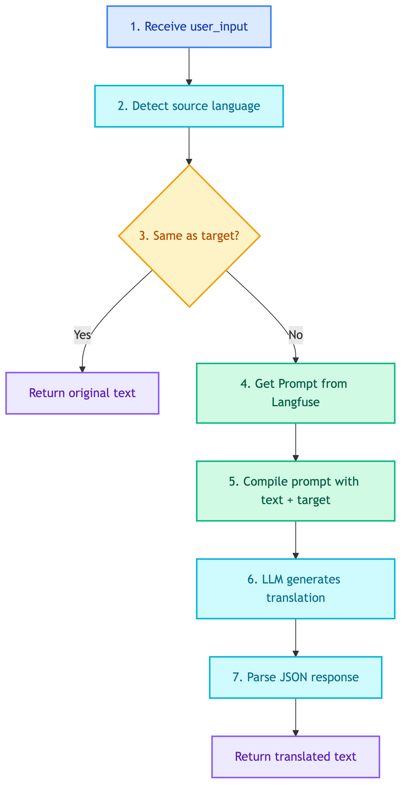

# **🌐 Translation Agent**

Agent for translating text between Thai and English.


---


## **📍 Location**

[`src/modules/agents/translation/main.py`](../../../../../src/modules/agents/translation/main.py)


---


## **📜 Prompt**

[translation.md](../../../../prompts/agents/translation.md)


---


## **📋 Class: TranslationAgent**

Inherits from `BaseAgent`.


### 💡 **Purpose**

Translate text between Thai and English. Detects source language and translates to target language.


### ⚙️ **Configuration**

| Property | Value |
|----------|-------|
| LLM | BaseLLM (direct, not ChatOpenAI) |
| Pattern | Direct LLM call (no ReAct) |
| Prompt | `translation` |


### 📥 **Input State**

| Field | Type | Description |
|-------|------|-------------|
| `user_input` | str | Text to translate |
| `target_lang` | str | Target language: "th" or "en" (optional) |


### 📤 **Output State**

| Field | Type | Description |
|-------|------|-------------|
| `translated_text` | str | Translated text |
| `detected_lang` | str | Detected source language |
| `target_lang` | str | Target language used |


### 🔄 **Code Flow**

<details>
<summary>📊 Code Flow</summary>



</details>


### 🔧 **Tools**

*No tools - uses direct LLM call*


### 🔧 **Methods**

| Method | Description |
|--------|-------------|
| `detect_language(text)` | Returns "th" or "en" |
| `translate(text, target_lang)` | Translate to target language |
| `execute(state)` | Main entry point |


---


### 💡 **Usage**

```python
from src.modules.agents.translation.main import TranslationAgent

agent = TranslationAgent(
    llm_client=llm_client,
    prompt_manager=prompt_manager,
)

# Auto-detect and translate
result = agent.execute({"user_input": "สวัสดี"})
# Returns: {"translated_text": "Hello", "detected_lang": "th", "target_lang": "en"}

# Specify target language
result = agent.execute({"user_input": "Hello", "target_lang": "th"})
# Returns: {"translated_text": "สวัสดี", "detected_lang": "en", "target_lang": "th"}
```
