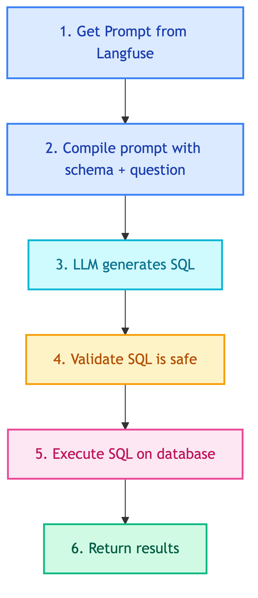

# **📊 Client Analytics SQL Tool**

BI analytics tool for internal client users.


---


## **📍 Location**

[`src/modules/tools/knowledge_retrieval/sql/client/analytics.py`](../../../../../../../src/modules/tools/knowledge_retrieval/sql/client/analytics.py)


---


## **📜 Prompt**

[tools_client_analytics_sql](../../../../../../prompts/tools/client/analytics_sql.md)


---


## **📋 Class: ClientAnalyticsSQLTool**

Inherits from `SQLTool`.


### 💡 **Purpose**

Query business data for analytics - revenue, orders, customers, products, and inventory analysis.


### ⚙️ **Configuration**

| Property | Value |
|----------|-------|
| Tables | All (full schema access) |
| Write | No (read-only) |
| Filter | None |
| Prompt | `tools_client_analytics_sql` |


### 📥 **Input Schema**

| Field | Type | Description |
|-------|------|-------------|
| `question` | str | Analytics question about business data |


### 🔄 **Code Flow**

<details>
<summary>📊 Code Flow</summary>



</details>


---


### 💡 **Usage**

```python
from src.modules.tools.knowledge_retrieval.sql.client.analytics import ClientAnalyticsSQLTool

tool = ClientAnalyticsSQLTool(
    sql_client=sql_client,
    llm_client=llm_client,
    prompt_manager=prompt_manager,
)

# Example queries
tool._run("What is total revenue this month?")
tool._run("Top 10 customers by order count")
tool._run("Products with low inventory")
```


---


### 💡 **Example Questions**

- "What is total revenue this month?"
- "Top 10 selling products"
- "Customer order frequency"
- "Inventory levels by warehouse"
- "Average order value by category"
