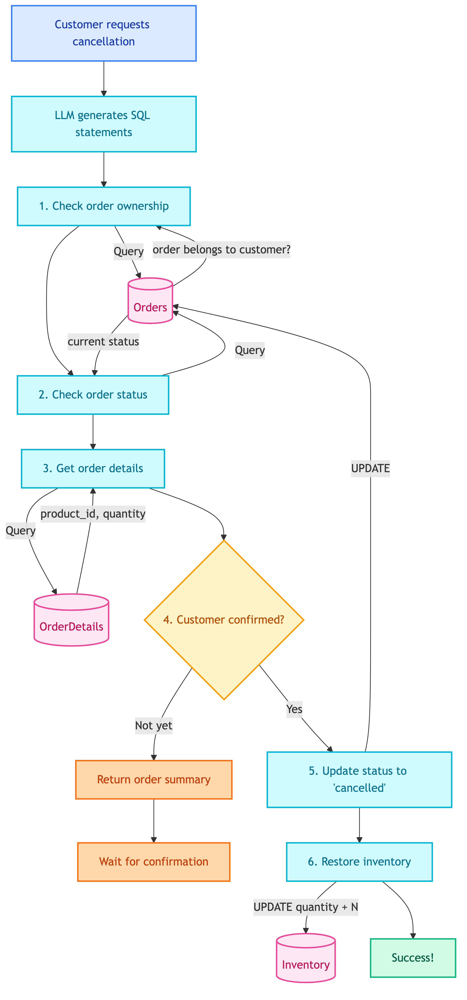

# **❌ Cancel Order SQL Tool**

Cancel customer orders and restore inventory.


---


## **📍 Location**

[`src/modules/tools/knowledge_retrieval/sql/customer/cancel_order.py`](../../../../../../../src/modules/tools/knowledge_retrieval/sql/customer/cancel_order.py)


---


## **📜 Prompt**

[tools_customer_cancel_order_sql](../../../../../../prompts/tools/customer/cancel_order_sql.md)


---


## **📋 Overview**

This tool handles order cancellation. Requires explicit customer confirmation before updating database. Automatically restores inventory when order is cancelled.

> ⚠️ **Important:** Requires explicit customer confirmation before updating database.


---


## **📥 Input**

| Field | Type | Description |
|-------|------|-------------|
| `order_id` | int | Order ID to cancel |
| `confirmed` | bool | `true` after customer confirms |


---


## **🔄 Flow Diagram**

<details>
<summary>📊 Flow Diagram</summary>



</details>


---


## **🗄️ Database Changes**


### 📋 **Tables Involved**

| Table | Operation | Description |
|-------|-----------|-------------|
| Orders | SELECT | Verify order exists and belongs to customer |
| Orders | SELECT | Check current status (not already cancelled) |
| OrderDetails | SELECT | Get items to restore inventory |
| Orders | UPDATE | Set status to 'cancelled' |
| Inventory | UPDATE | Add back the cancelled quantities |


### 🔢 **Step-by-Step Database Operations**


#### 1️⃣ **Check Order Ownership (SELECT)**
```sql
SELECT order_id, customer_id, order_date, total_amount 
FROM Orders 
WHERE order_id = {order_id} AND customer_id = {customer_id}
```
- **Purpose**: Verify order exists AND belongs to this customer
- **Fail**: Returns error if order not found or belongs to different customer


#### 2️⃣ **Check Order Status (SELECT)**
```sql
SELECT status 
FROM Orders 
WHERE order_id = {order_id}
```
- **Purpose**: Verify order is not already cancelled
- **Fail**: Returns error if status = 'cancelled'


#### 3️⃣ **Get Order Details (SELECT)**
```sql
SELECT od.product_id, od.quantity, p.product_name
FROM OrderDetails od
JOIN Products p ON od.product_id = p.product_id
WHERE od.order_id = {order_id}
```
- **Purpose**: Get items for inventory restoration and confirmation display


#### 4️⃣ **Wait for Confirmation (No DB change)**
- If `confirmed=false`, returns order summary for customer review
- **No database writes at this step**


#### 5️⃣ **Update Order Status (UPDATE)**
```sql
UPDATE Orders 
SET status = 'cancelled'
WHERE order_id = {order_id}
```
- **Table**: Orders
- **Change**: status changes from 'pending' to 'cancelled'


#### 6️⃣ **Restore Inventory (UPDATE)**
```sql
UPDATE Inventory 
SET quantity = quantity + {quantity}
WHERE product_id = {product_id}
```
- **Table**: Inventory
- **Change**: Adds back the cancelled quantity to stock


---


## **✅ Two-Step Confirmation**

Prevents accidental cancellations:

| Call | confirmed | Database Write | Response |
|------|-----------|----------------|----------|
| First | `false` | ❌ No write | Order summary + await confirmation |
| Second | `true` | ✅ Write | Order cancelled + inventory restored |


---


## **💡 Example**


### 📥 **Input**
```
Customer: Cancel my order #1001
```


### 1️⃣ **First Call (confirmed=false)**
```python
tool._run(order_id=1001, confirmed=False)
```

**Response:**
```python
{
    "success": True,
    "needs_confirmation": True,
    "order_id": 1001,
    "order_date": "2025-01-03",
    "total_amount": 558,
    "status": "pending",
    "products": ["2x Gaming Chair"],
    "message": "Please confirm: Cancel Order #1001 (2x Gaming Chair) for $558?"
}
```

**Database**: No changes


### 2️⃣ **Second Call (confirmed=true)**
```python
tool._run(order_id=1001, confirmed=True)
```

**Response:**
```python
{
    "success": True,
    "order_id": 1001,
    "previous_status": "pending",
    "new_status": "cancelled"
}
```

**Database Changes:**

| Table | Before | After |
|-------|--------|-------|
| Orders (order_id=1001) | status='pending' | status='cancelled' |
| Inventory (Gaming Chair) | quantity=22 | quantity=24 (restored) |


---


## **❌ Error Cases**

| Error | Cause | Database |
|-------|-------|----------|
| Order not found | order_id doesn't exist | No changes |
| Not your order | order belongs to different customer | No changes |
| Already cancelled | status is already 'cancelled' | No changes |
| Customer ID not set | customer_id is null | No changes |


---


## **🔒 Security**

- Orders can only be cancelled by the customer who placed them
- SQL includes `customer_id` filter to prevent unauthorized cancellation
- Already cancelled orders cannot be cancelled again


