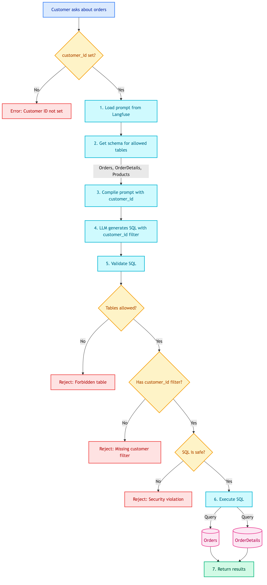
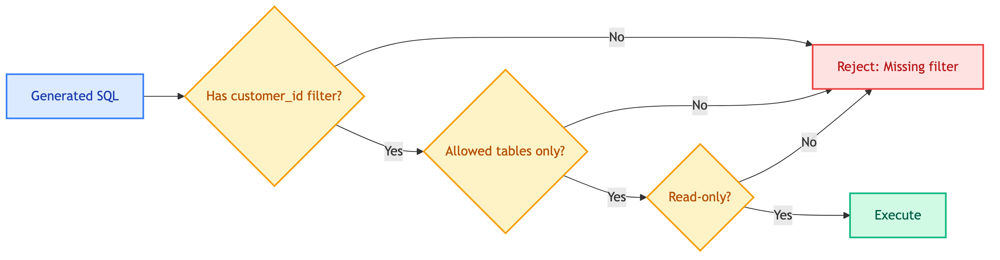

# **📦 Customer Order SQL Tool**

Order history queries for customers.


---


## **📍 Location**

[`src/modules/tools/knowledge_retrieval/sql/customer/order.py`](../../../../../../../src/modules/tools/knowledge_retrieval/sql/customer/order.py)


---


## **📜 Prompt**

[tools_customer_order_sql](../../../../../../prompts/tools/customer/order_sql.md)


---


## **📋 Overview**

Query customer's own order history - order status, purchase history. **Read-only** tool that automatically filters by customer_id.


---


## **📥 Input**

| Field | Type | Description |
|-------|------|-------------|
| `question` | str | Question about your orders |


---


## **🔄 Flow Diagram**

<details>
<summary>📊 Flow Diagram</summary>



</details>


---


## **🗄️ Database Access**


### ✅ **Allowed Tables (Read-Only)**

| Table | Columns | Description |
|-------|---------|-------------|
| Orders | order_id, customer_id, order_date, status, total_amount | Order headers |
| OrderDetails | order_detail_id, order_id, product_id, quantity, unit_price | Order line items |
| Products | product_id, product_name, price | Product names for display |


### 🔒 **Automatic Filtering**

All queries are automatically filtered by `customer_id`:

```sql
-- LLM always includes this filter
WHERE customer_id = {customer_id}
```

This prevents customers from seeing other customers' orders.


### 🔒 **Security Validation**




---


## **💡 Example**


### 📥 **Input**
```
Customer: Show me my recent orders
```


### 🔧 **Generated SQL**
```sql
SELECT o.order_id, o.order_date, o.status, o.total_amount
FROM Orders o
WHERE o.customer_id = '1'
ORDER BY o.order_date DESC
LIMIT 10
```


### 🗄️ **Database Query**

| Table | Operation | Purpose |
|-------|-----------|---------|
| Orders | SELECT | Get order list for this customer only |


### 📤 **Response**
```python
{
    "sql": "SELECT ... WHERE customer_id = '1' ...",
    "results": [
        {"order_id": 1001, "order_date": "2025-01-03", "status": "pending", "total_amount": 558},
        {"order_id": 998, "order_date": "2025-01-01", "status": "delivered", "total_amount": 1299}
    ]
}
```

**Database Changes**: None (read-only)


---


## **💡 Example Questions**

| Question | Tables Accessed |
|----------|-----------------|
| "Show me my orders" | Orders |
| "What's the status of order #1001?" | Orders |
| "Show me what I ordered last month" | Orders, OrderDetails, Products |
| "How much did I spend this year?" | Orders |


---


## **🔒 Privacy Protection**

| Protection | How |
|------------|-----|
| Only own orders | SQL must contain `customer_id = {current_customer}` |
| No other customers | Cannot query without customer_id filter |
| Read-only | Cannot modify orders (use cancel_order tool instead) |


---


## **❌ Error Cases**

| Error | Cause | Response |
|-------|-------|----------|
| Customer ID not set | Tool called without customer context | Error message |
| Missing customer filter | SQL doesn't filter by customer_id | Reject query |
| Forbidden table access | Query tries to access Customers table | Reject query |


