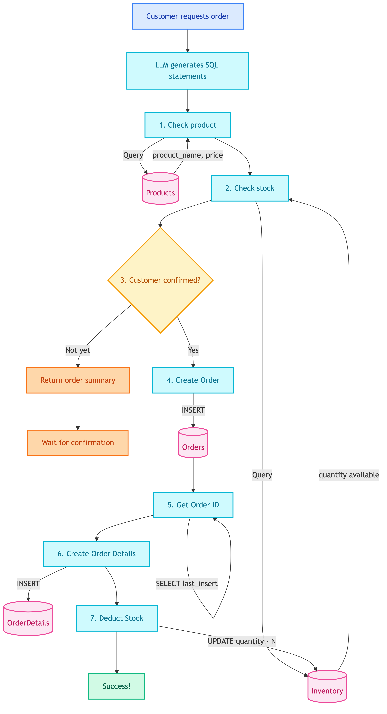

# **🛒 Place Order SQL Tool**

Create orders for customers.


---


## **📍 Location**

[`src/modules/tools/knowledge_retrieval/sql/customer/place_order.py`](../../../../../../../src/modules/tools/knowledge_retrieval/sql/customer/place_order.py)


---


## **📜 Prompt**

[tools_customer_place_order_sql](../../../../../../prompts/tools/customer/place_order_sql.md)


---


## **📋 Overview**

This tool handles order placement. Requires explicit customer confirmation before writing to database.

> ⚠️ **Important:** Requires explicit customer confirmation before writing to database.


---


## **📥 Input**

| Field | Type | Description |
|-------|------|-------------|
| `product_id` | int | Product ID to order |
| `quantity` | int | Quantity to order (>= 1) |
| `confirmed` | bool | `true` after customer confirms |


---


## **🔄 Flow Diagram**

<details>
<summary>📊 Flow Diagram</summary>



</details>


---


## **🗄️ Database Changes**


### 📋 **Tables Involved**

| Table | Operation | Description |
|-------|-----------|-------------|
| Products | SELECT | Get product info (name, price) |
| Inventory | SELECT | Check available stock |
| Orders | INSERT | Create new order record |
| OrderDetails | INSERT | Create order line items |
| Inventory | UPDATE | Deduct stock by ordered quantity |


### 🔢 **Step-by-Step Database Operations**


#### 1️⃣ **Check Product (SELECT)**
```sql
SELECT product_id, product_name, price 
FROM Products 
WHERE product_id = {product_id}
```
- **Purpose**: Verify product exists and get price
- **Fail**: Returns error if product_id not found


#### 2️⃣ **Check Stock (SELECT)**
```sql
SELECT quantity 
FROM Inventory 
WHERE product_id = {product_id}
```
- **Purpose**: Verify sufficient stock available
- **Fail**: Returns error if stock < requested quantity


#### 3️⃣ **Wait for Confirmation (No DB change)**
- If `confirmed=false`, returns order summary for customer review
- **No database writes at this step**


#### 4️⃣ **Create Order (INSERT)**
```sql
INSERT INTO Orders (customer_id, order_date, status, total_amount)
VALUES ({customer_id}, date('now'), 'pending', {total_price})
```
- **Table**: Orders
- **New Record**: Order with status = 'pending'


#### 5️⃣ **Get Order ID (SELECT)**
```sql
SELECT last_insert_rowid() as order_id
```
- **Purpose**: Get newly created order_id for OrderDetails


#### 6️⃣ **Create Order Details (INSERT)**
```sql
INSERT INTO OrderDetails (order_id, product_id, quantity, unit_price)
VALUES ({order_id}, {product_id}, {quantity}, {price})
```
- **Table**: OrderDetails
- **New Record**: Line item for the order


#### 7️⃣ **Deduct Stock (UPDATE)**
```sql
UPDATE Inventory 
SET quantity = quantity - {quantity}
WHERE product_id = {product_id}
```
- **Table**: Inventory
- **Change**: Reduces quantity by ordered amount


---


## **✅ Two-Step Confirmation**

Prevents accidental orders:

| Call | confirmed | Database Write | Response |
|------|-----------|----------------|----------|
| First | `false` | ❌ No write | Order summary + await confirmation |
| Second | `true` | ✅ Write | Order completed |


---


## **💡 Example**


### 📥 **Input**
```
Customer: Order 2 gaming chairs
```


### 1️⃣ **First Call (confirmed=false)**
```python
tool._run(product_id=10, quantity=2, confirmed=False)
```

**Response:**
```python
{
    "success": True,
    "needs_confirmation": True,
    "product_name": "Gaming Chair",
    "quantity": 2,
    "price_per_unit": 279,
    "total_price": 558,
    "available_stock": 24,
    "message": "Please confirm: Order 2x Gaming Chair for $558?"
}
```

**Database**: No changes


### 2️⃣ **Second Call (confirmed=true)**
```python
tool._run(product_id=10, quantity=2, confirmed=True)
```

**Response:**
```python
{
    "success": True,
    "order_id": 1001,
    "product_id": 10,
    "quantity": 2
}
```

**Database Changes:**

| Table | Before | After |
|-------|--------|-------|
| Orders | - | New row: order_id=1001, customer_id=1, status='pending', total=558 |
| OrderDetails | - | New row: order_id=1001, product_id=10, qty=2, price=279 |
| Inventory (Gaming Chair) | quantity=24 | quantity=22 |


---


## **❌ Error Cases**

| Error | Cause | Database |
|-------|-------|----------|
| Product not found | product_id doesn't exist | No changes |
| Insufficient stock | Requested > available | No changes |
| Customer ID not set | customer_id is null | No changes |


