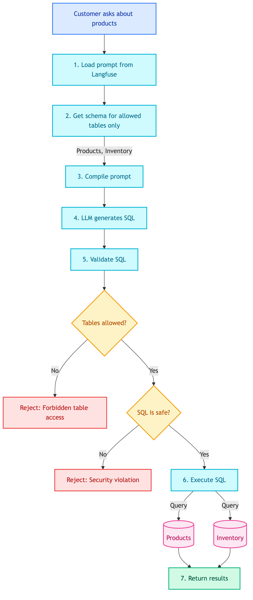
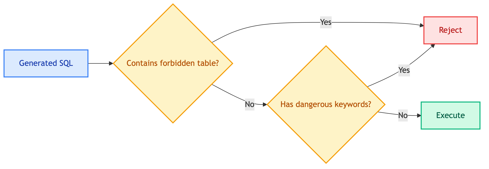

# **🛒 Customer Product SQL Tool**

Product and inventory queries for customers.


---


## **📍 Location**

[`src/modules/tools/knowledge_retrieval/sql/customer/product.py`](../../../../../../../src/modules/tools/knowledge_retrieval/sql/customer/product.py)


---


## **📜 Prompt**

[tools_customer_product_sql](../../../../../../prompts/tools/customer/product_sql.md)


---


## **📋 Overview**

Query product information - details, prices, stock levels. **Read-only** tool restricted to product-related tables.


---


## **📥 Input**

| Field | Type | Description |
|-------|------|-------------|
| `question` | str | Question about products or inventory |


---


## **🔄 Flow Diagram**

<details>
<summary>📊 Flow Diagram</summary>



</details>


---


## **🗄️ Database Access**


### ✅ **Allowed Tables (Read-Only)**

| Table | Columns | Description |
|-------|---------|-------------|
| Products | product_id, product_name, category, price, description | Product catalog |
| Inventory | product_id, quantity, color, warehouse_id | Stock levels |


### 🚫 **Forbidden Tables**

| Table | Reason |
|-------|--------|
| Customers | Privacy - customer data |
| Orders | Privacy - other customers' orders |
| OrderDetails | Privacy - order details |


### 🔒 **Security Validation**



> 🚨 **Warning:** Blocked patterns:
- `DROP`, `DELETE`, `UPDATE`, `INSERT` (write operations)
- Access to Customers, Orders, OrderDetails tables


---


## **💡 Example**


### 📥 **Input**
```
Customer: Is the Gaming Chair in stock?
```


### 🔧 **Generated SQL**
```sql
SELECT p.product_name, i.quantity, i.color
FROM Products p
JOIN Inventory i ON p.product_id = i.product_id
WHERE p.product_name LIKE '%Gaming Chair%'
```


### 🗄️ **Database Query**

| Table | Operation | Purpose |
|-------|-----------|---------|
| Products | SELECT | Get product name, price |
| Inventory | SELECT | Get stock quantity by color |


### 📤 **Response**
```python
{
    "sql": "SELECT p.product_name, i.quantity, i.color FROM Products p JOIN Inventory i ON p.product_id = i.product_id WHERE p.product_name LIKE '%Gaming Chair%'",
    "results": [
        {"product_name": "Gaming Chair", "quantity": 24, "color": "Gold"}
    ]
}
```

**Database Changes**: None (read-only)


---


## **💡 Example Questions**

| Question | Tables Accessed |
|----------|-----------------|
| "Show me all laptops under $1000" | Products |
| "Is the iPhone 15 in stock?" | Products, Inventory |
| "What colors are available for Gaming Chair?" | Products, Inventory |
| "How many products do you have?" | Products |


---


## **❌ Error Cases**

| Error | Cause | Response |
|-------|-------|----------|
| Forbidden table access | Query tries to access Orders/Customers | Reject with error message |
| SQL security violation | Contains DROP/DELETE/UPDATE | Reject with error message |


