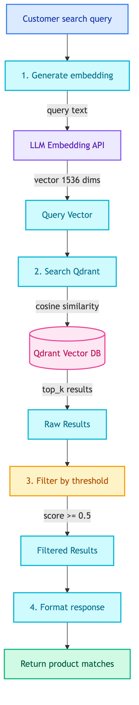
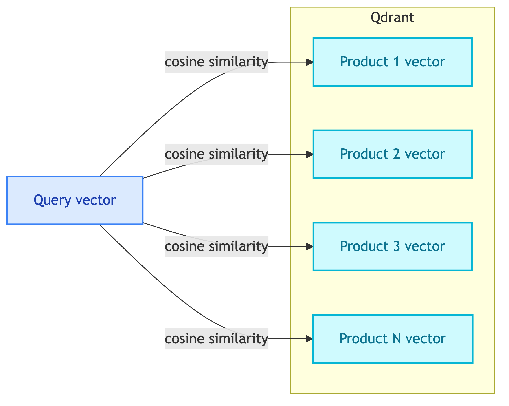

# **🔍 Product Search Tool**

Semantic search for products using natural language.


---


## **📍 Location**

[`src/modules/tools/knowledge_retrieval/vectordb/search.py`](../../../../../../src/modules/tools/knowledge_retrieval/vectordb/search.py)


---


## **📋 Overview**

Search for products using semantic similarity. Useful when customer describes what they want in natural language instead of exact product names.


---


## **📥 Input**

| Field | Type | Default | Description |
|-------|------|---------|-------------|
| `query` | str | required | Search query text (e.g., "wireless headphones") |
| `top_k` | int | 10 | Maximum number of results |
| `similarity_threshold` | float | 0.5 | Minimum similarity score (0-1) |


---


## **🔄 Flow Diagram**

<details>
<summary>📊 Flow Diagram</summary>



</details>


---


## **🔧 How It Works**


### 1️⃣ **Text to Vector**

Customer's query is converted to a vector embedding:

```
"wireless headphones" → [0.023, -0.156, 0.089, ...] (1536 dimensions)
```


### 2️⃣ **Vector Search**

The query vector is compared against all product vectors in Qdrant:




### 3️⃣ **Similarity Scoring**

| Score | Meaning |
|-------|---------|
| 1.0 | Exact match |
| 0.7+ | Very relevant |
| 0.5+ | Somewhat relevant |
| < 0.5 | Filtered out |


### 4️⃣ **Return Results**

Results sorted by similarity score (highest first).


---


## **🗄️ Database Access**


### 🔍 **Qdrant Vector Database**

| Collection | Content | Purpose |
|------------|---------|---------|
| products | Product embeddings | Semantic search |


### 📋 **What's Stored in Qdrant**

Each product has:

| Field | Type | Example |
|-------|------|---------|
| vector | float[1536] | Embedding of combined product text |
| product_id | int | 10 |
| product_name | string | "Gaming Chair" |
| source_file | string | "10_gaming_chair.pdf" |
| text | string | Combined text (name + description + specs + features) |

> 📝 **Note:** Fields like `category`, `price`, and full `description` are stored in the SQL database, not in Qdrant.

**Database Changes**: None (read-only search)


---


## **💡 Example**


### 📥 **Input**
```
Customer: I'm looking for wireless headphones
```


### 🔢 **Step-by-Step**

1. **Generate embedding** for "wireless headphones"
2. **Search Qdrant** for similar product vectors
3. **Filter** results with score >= 0.5
4. **Return** matching products


### 📤 **Response**
```python
{
    "query": "wireless headphones",
    "results": [
        {
            "product_id": 5,
            "score": 0.82,
            "metadata": {
                "product_name": "Wireless Bluetooth Headphones",
                "category": "Electronics",
                "price": 149.99
            }
        },
        {
            "product_id": 8,
            "score": 0.76,
            "metadata": {
                "product_name": "Noise Cancelling Headphones",
                "category": "Electronics",
                "price": 299.99
            }
        }
    ]
}
```


---


## **💡 When to Use**

| Use Case | Tool |
|----------|------|
| "I want something for gaming" | ✅ ProductSearchTool (semantic) |
| "Show me product ID 10" | ❌ Use SQL tool (exact) |
| "wireless speaker under $100" | ✅ Search + SQL filter |


---


## **📊 Comparison with SQL**

| Aspect | VectorDB Search | SQL Query |
|--------|-----------------|-----------|
| Query type | Natural language | Exact match |
| "gaming accessories" | ✅ Finds related products | ❌ Needs exact category |
| "something for work from home" | ✅ Understands intent | ❌ Cannot interpret |
| Speed | Fast (pre-indexed) | Fast |


---


## **❌ Error Cases**

| Error | Cause | Response |
|-------|-------|----------|
| Empty results | No products match query | `{"results": []}` |
| Embedding failed | LLM API error | `{"error": "..."}` |


