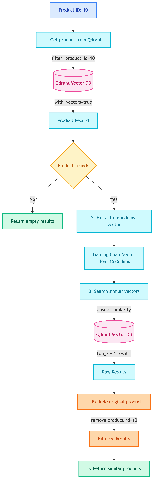
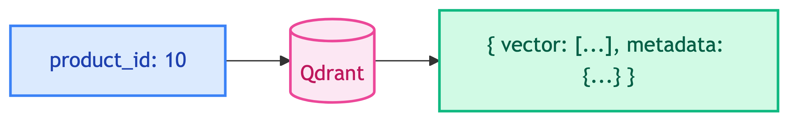
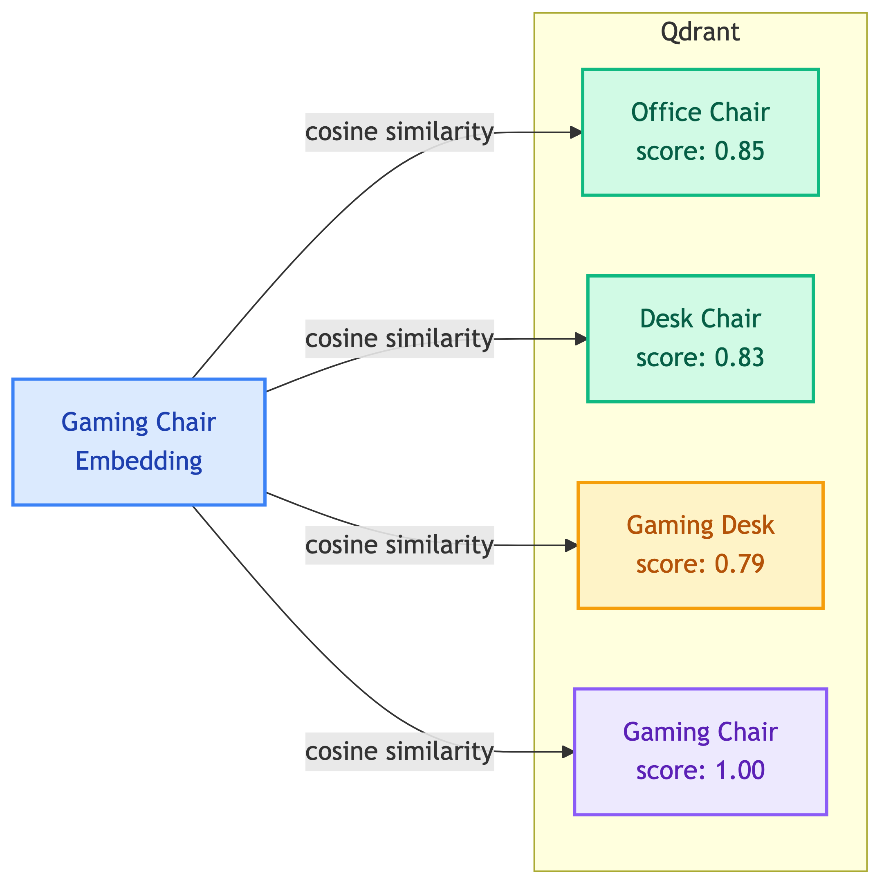
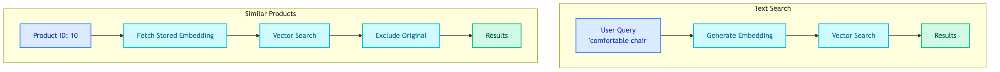

# **🔗 Similar Products Tool**

Find products similar to a given product using vector similarity.


---


## **📍 Location**

[`src/modules/tools/knowledge_retrieval/vectordb/similar.py`](../../../../../../src/modules/tools/knowledge_retrieval/vectordb/similar.py)


---


## **📋 Overview**

Find similar products based on vector similarity. Gets the embedding of a product and finds nearest neighbors in Qdrant.


---


## **📥 Input**

| Field | Type | Default | Description |
|-------|------|---------|-------------|
| `product_id` | int | required | Base product ID |
| `top_k` | int | 5 | Number of similar products |


---


## **🔄 Flow Diagram**

<details>
<summary>📊 Flow Diagram</summary>



</details>


---


## **🔧 How It Works**


### 1️⃣ **Retrieve Product's Embedding**



The tool fetches the stored embedding vector for this product:

```python
records = self.vector_store.get(
    filter={"product_id": product_id},
    with_vectors=True,
    limit=1,
)
product_embedding = records[0]["vector"]
```


### 2️⃣ **Vector Similarity Search**

<details>
<summary>📊 Step 2: Vector Similarity Search</summary>



</details>


### 3️⃣ **Exclude Original Product**

Remove Gaming Chair from results (it's the same item we started with):

| Before Filtering | After Filtering |
|------------------|-----------------|
| Gaming Chair (1.00) | ~~removed~~ |
| Office Chair (0.85) | Office Chair (0.85) |
| Desk Chair (0.83) | Desk Chair (0.83) |
| Gaming Desk (0.79) | Gaming Desk (0.79) |


### 4️⃣ **Return Results**

```python
{
    "product_id": 10,
    "results": [
        {"product_id": 25, "score": 0.85, "metadata": {"product_name": "Office Chair", ...}},
        {"product_id": 18, "score": 0.83, "metadata": {"product_name": "Desk Chair", ...}},
        {"product_id": 42, "score": 0.79, "metadata": {"product_name": "Gaming Desk", ...}},
    ]
}
```


---


## **🗄️ Database Access**


### 🔍 **Qdrant Vector Database**

| Operation | Description |
|-----------|-------------|
| `get()` | Retrieve specific product by ID with its vector |
| `search()` | Find nearest neighbors using cosine similarity |


### 📋 **What's Stored in Qdrant**

Each product has:

| Field | Type | Example |
|-------|------|---------|
| vector | float[1536] | Embedding of combined product text |
| product_id | int | 10 |
| product_name | string | "Gaming Chair" |
| source_file | string | "10_gaming_chair.pdf" |
| text | string | Combined text (name + description + specs + features) |

> 📝 **Note:** Fields like `category`, `price`, and full `description` are stored in the SQL database, not in Qdrant.

**Database Changes**: None (read-only search)


---


## **📊 Comparison: Text Search vs Similar Products**



| Aspect | Text Search | Similar Products |
|--------|-------------|------------------|
| **Input** | User's text query | Product ID |
| **Embedding** | Generated at query time | Retrieved from database |
| **Use Case** | "Find gaming chairs" | "Products like this chair" |


---


## **💡 When to Use**

| User Request | What Happens |
|--------------|--------------|
| "Show me products similar to this one" | Uses current product's embedding |
| "What are some alternatives?" | Finds semantically similar products |
| "I like this, what else would I like?" | Recommends based on product features |


---


## **❌ Error Cases**

| Error | Cause | Response |
|-------|-------|----------|
| Product not found | product_id doesn't exist in Qdrant | `{"product_id": 10, "results": []}` |
| Search failed | Qdrant connection error | `{"error": "..."}` |


