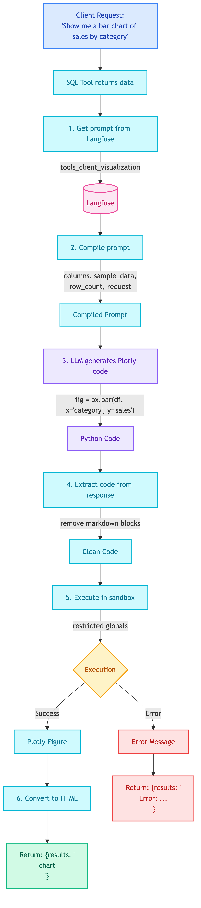
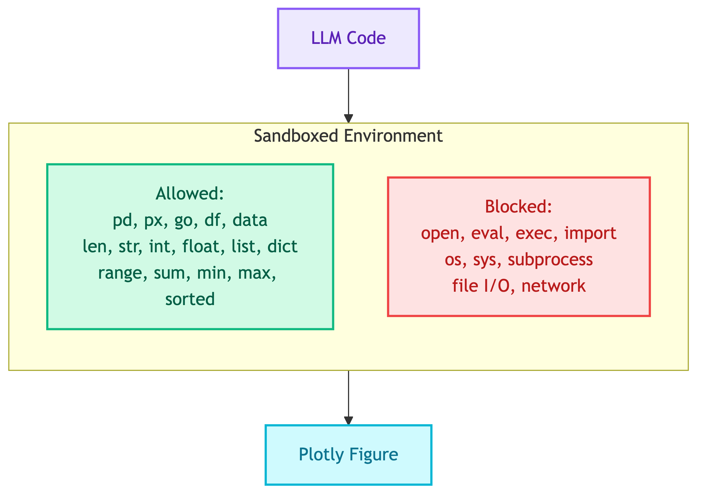
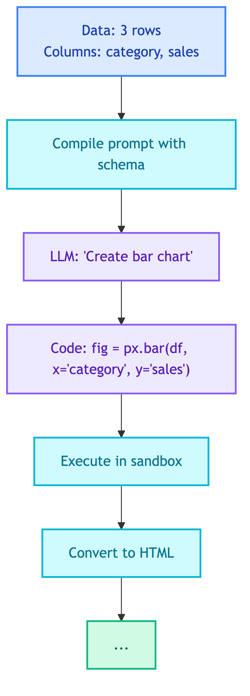

# **📊 Visualization Tool**

Create Plotly visualizations using LLM-generated code.


---


## **📍 Location**

[`src/modules/tools/visualization/main.py`](../../../../../src/modules/tools/visualization/main.py)

## **📜 Prompt**

[tools_client_visualization](../../../../prompts/tools/client/visualization.md)


---


## **📋 Overview**

Create Plotly charts from data using natural language requests. Uses LLM to generate Plotly code, then executes in a sandboxed environment.

## **📥 Input**

| Field | Type | Description |
|-------|------|-------------|
| `data` | list[dict] | Data to visualize (from SQL query results) |
| `request` | str | Natural language description of the chart |


---


## **🔄 Flow Diagram**

<details>
<summary>📊 Flow Diagram</summary>



</details>


---


## **🔧 How It Works**


### 1️⃣ **Get Prompt from Langfuse**


The tool retrieves the prompt template `tools_client_visualization` from Langfuse.

### 2️⃣ **Compile Prompt with Data Context**

The prompt is compiled with information about the data:

| Variable | Example |
|----------|---------|
| `columns` | `["category", "sales", "month"]` |
| `sample_data` | First 3 rows of data |
| `row_count` | `150` |
| `request` | "Show me a bar chart of sales by category" |

```python
compiled = prompt.compile(
    columns=json.dumps(columns),
    sample_data=json.dumps(sample, indent=2),
    row_count=len(data),
    request=request,
)
```

### 3️⃣ **LLM Generates Plotly Code**

The LLM generates Python code that creates a Plotly chart:

```python
# Example LLM output
import plotly.express as px

fig = px.bar(
    df, 
    x='category', 
    y='sales',
    title='Sales by Category'
)
```

### 4️⃣ **Extract Code from Response**

Remove markdown code blocks if present:

```
Input:  ```python\nfig = px.bar(...)\n```
Output: fig = px.bar(...)
```

### 5️⃣ **Execute in Sandbox**



> 🚨 **Security:** The code runs in a restricted environment to prevent malicious code execution.

| Allowed | Blocked |
|---------|---------|
| `pd` (pandas) | `open()` |
| `px` (plotly.express) | `eval()` |
| `go` (plotly.graph_objects) | `exec()` |
| `df`, `data` variables | `import` |
| `len`, `str`, `int`, `float` | File I/O |
| `list`, `dict`, `range` | Network access |
| `sum`, `min`, `max`, `sorted` | `os`, `sys`, `subprocess` |

### 6️⃣ **Convert to HTML**

The Plotly figure is converted to HTML for display in the UI:

```python
html = fig.to_html(full_html=False, include_plotlyjs="cdn")
```

---


## **🗄️ Database Access**

**None** - This tool does not access any database. It receives data from the SQL tool and only performs visualization.


---


## **💡 Example**


### 📥 **Input**

```python
data = [
    {"category": "Electronics", "sales": 50000},
    {"category": "Clothing", "sales": 35000},
    {"category": "Home", "sales": 28000},
]
request = "Create a bar chart showing sales by category"
```

### 🔢 **Step-by-Step**

<details>
<summary>📊 Step-by-Step</summary>



</details>


### 📤 **Output**

**Success:**
```python
{
    "request": "Create a bar chart showing sales by category",
    "results": "<div id='abc123'>...</div>"  # Plotly HTML
}
```

**Error:**
```python
{
    "request": "Create a bar chart showing sales by category",
    "results": "<p>Error: Failed to create visualization: ...</p>"
}
```


---


## **💡 When to Use**

| Scenario | Use Visualization? |
|----------|-------------------|
| "Show sales data as a chart" | Yes |
| "Create a pie chart of categories" | Yes |
| "List all products" | No (use SQL only) |
| "What's the total revenue?" | No (return number) |

## **📊 Common Chart Types**

| Request | Chart Type |
|---------|------------|
| "bar chart of X by Y" | `px.bar()` |
| "pie chart of distribution" | `px.pie()` |
| "line chart over time" | `px.line()` |
| "scatter plot of X vs Y" | `px.scatter()` |
| "histogram of values" | `px.histogram()` |

---


## **❌ Error Cases**

| Error | Cause | Response |
|-------|-------|----------|
| Empty data | SQL returned no results | `"<p>No data available for visualization</p>"` |
| Code execution failed | Invalid Plotly code | `"<p>Error: Failed to execute visualization code: ...</p>"` |
| No figure created | Code didn't create `fig` | `"<p>Error: No Plotly figure was created by the code</p>"` |


