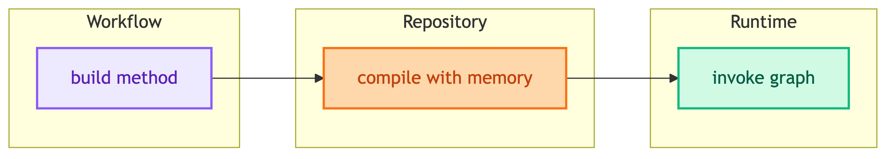
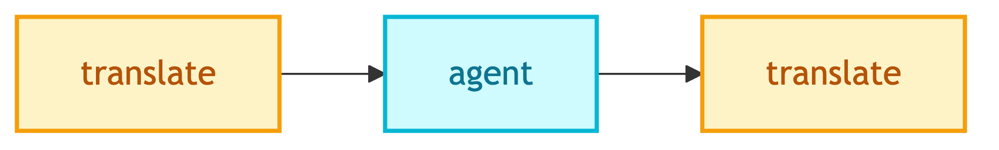
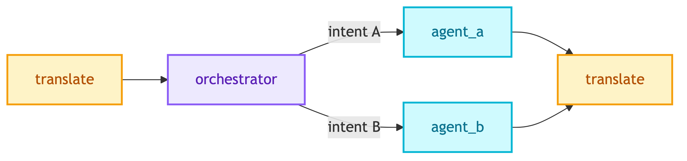

# **🔄 Workflows**

LangGraph workflows that orchestrate agents.


---


## **📍 Location**

[`src/modules/workflows/`](../../../../src/modules/workflows/)


---


## **📋 Overview**

Workflows define graph structure (nodes, edges) but do NOT compile. Compilation with checkpointer + store is handled by [ChatbotRepository](../../repositories/chatbots/README.md).


---


## **🏗️ Architecture**




---


## **📦 Available Workflows**

| | |
|:---:|:---:|
| [💼 **ClientChatbotWorkflow**](client_chatbot/main.md)<br/>Internal BI chatbot | [👤 **CustomerChatbotWorkflow**](customer_chatbot/main.md)<br/>Customer shopping assistant |


---


## **🎯 Base Class**

See [base.md](base.md) for full documentation.

```python
from src.modules.workflows.base import BaseWorkflow

class MyWorkflow(BaseWorkflow):
    def build(self) -> StateGraph:
        graph = StateGraph(MyState)
        # Add nodes and edges
        return graph  # NOT compiled
```


---


## **🔀 Workflow Patterns**


### 📊 **Fixed Flow (CustomerChatbot)**



Simple linear flow where every query follows same path.


### 🔀 **Conditional Flow (ClientChatbot)**



Uses conditional edges to route based on classified intent.


---


## **📂 Files**

```
src/modules/workflows/
├── base.py                    # BaseWorkflow class
├── client_chatbot/
│   ├── __init__.py
│   ├── state.py               # ClientChatbotState
│   └── main.py                # ClientChatbotWorkflow
└── customer_chatbot/
    ├── __init__.py
    ├── state.py               # ShoppingState
    └── main.py                # CustomerChatbotWorkflow
```


---


## **📖 Documentation**

| | | |
|:---:|:---:|:---:|
| [🎯 **Base**](base.md)<br/>BaseWorkflow abstract class | [💼 **Client Main**](client_chatbot/main.md)<br/>Client workflow implementation | [💼 **Client State**](client_chatbot/state.md)<br/>Client state definition |
| [👤 **Customer Main**](customer_chatbot/main.md)<br/>Customer workflow implementation | [👤 **Customer State**](customer_chatbot/state.md)<br/>Customer state definition | |
