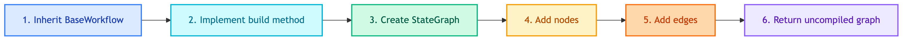

# **🔄 BaseWorkflow**

Abstract base class for all LangGraph workflows.


---


## **📍 Location**

[`src/modules/workflows/base.py`](../../../../src/modules/workflows/base.py)


---


## **📋 Class Definition**

```python
class BaseWorkflow(ABC):
    @abstractmethod
    def build(self) -> StateGraph:
        """Build and return the uncompiled graph."""
        pass

    def _build_conversation_messages(
        self, 
        query: str, 
        response: str, 
        tool_steps: list[dict]
    ) -> list:
        """Build messages list with ToolMessages for checkpoint."""
```


---


## **💡 Purpose**

1. **Define contract** - All workflows must implement `build()` returning uncompiled StateGraph
2. **Separation of concerns** - Workflow builds graph, Repository compiles with checkpointer/store
3. **Message building** - Helper to construct conversation messages with tool steps


---


## **🔄 Code Flow**




---


## **🔧 Key Methods**


### 🔨 **`build() -> StateGraph`**

Abstract method that subclasses must implement.

| Step | Description |
|------|-------------|
| 1 | Create `StateGraph` with state type |
| 2 | Add nodes (agents, tools) |
| 3 | Add edges (normal, conditional) |
| 4 | Set entry point |
| 5 | Return **uncompiled** graph |


### 🔨 **`_build_conversation_messages()`**

Helper method to build message list for checkpointing.

| Input | Type | Description |
|-------|------|-------------|
| query | str | User's input query |
| response | str | Agent's response |
| tool_steps | list[dict] | Tool calls with results |

| Output | Type | Description |
|--------|------|-------------|
| messages | list | HumanMessage + AIMessage + ToolMessages |


---


## **💡 Usage Pattern**

```python
from src.modules.workflows.base import BaseWorkflow
from langgraph.graph import StateGraph

class MyWorkflow(BaseWorkflow):
    def __init__(self, agent1, agent2):
        self.agent1 = agent1
        self.agent2 = agent2

    def build(self) -> StateGraph:
        graph = StateGraph(MyState)
        
        # Add nodes
        graph.add_node("step1", self._run_agent1)
        graph.add_node("step2", self._run_agent2)
        
        # Add edges
        graph.set_entry_point("step1")
        graph.add_edge("step1", "step2")
        graph.add_edge("step2", END)
        
        return graph  # NOT compiled!
```


---


## **❓ Why Not Compile Here?**

Compilation happens in Repository layer because:

1. **Checkpointer** - Needs Redis/Postgres connection
2. **Store** - Needs database connection for long-term memory
3. **Flexibility** - Same workflow, different storage backends

> 📝 **Note:** See [Repositories](../../repositories/chatbots/README.md) for compilation details.
