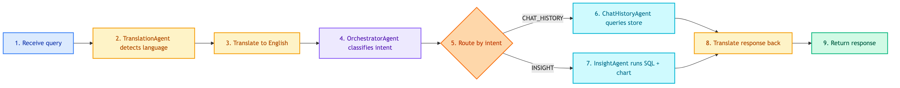

# **💼 ClientChatbotWorkflow**

Internal BI chatbot workflow for business users.


---


## **📍 Location**

[`src/modules/workflows/client_chatbot/main.py`](../../../../../src/modules/workflows/client_chatbot/main.py)


---


## **💡 Purpose**

Orchestrate agents for internal business intelligence queries:
- Customer chat history lookup
- Sales analytics and insights with visualization


---


## **📊 Graph Structure**


---


## **🔄 Code Flow**




---


## **🤖 Agents Reference**

| Agent | Location | Purpose | Documentation |
|-------|----------|---------|---------------|
| TranslationAgent | `src/modules/agents/translation/` | Detect language, translate TH ↔ EN | [translation/main.md](../../agents/translation/main.md) |
| OrchestratorAgent | `src/modules/agents/client/orchestrator.py` | Classify intent (CHAT_HISTORY/INSIGHT) | [client/orchestrator.md](../../agents/client/orchestrator.md) |
| CustomerChatHistoryAgent | `src/modules/agents/client/chat_history.py` | Query customer chat history | [client/chat_history.md](../../agents/client/chat_history.md) |
| CustomerInsightAgent | `src/modules/agents/client/insight.py` | SQL analytics + visualization | [client/insight.md](../../agents/client/insight.md) |


---


## **📋 State**

See [state.md](state.md) for full state definition.

| Field | Type | Description |
|-------|------|-------------|
| messages | list[BaseMessage] | Conversation history |
| query | str | User's raw input |
| user_language | str | Detected language ("th"/"en") |
| translated_query | str | Query in English |
| intent | Intent | CHAT_HISTORY or INSIGHT |
| response | str | Final response |
| chart_html | str | Plotly chart HTML (if visualization) |
| steps | list[dict] | Tool execution steps |


---


## **🔧 Node Implementation**


### 🌐 **translate_input**

```python
def _translate_input(self, state: ClientChatbotState) -> dict:
    # 1. Get query from state
    # 2. Call TranslationAgent.execute()
    # 3. Return user_language + translated_query
```


### 🎯 **orchestrator**

```python
def _orchestrator(self, state: ClientChatbotState) -> dict:
    # 1. Get translated_query
    # 2. Call OrchestratorAgent.execute()
    # 3. Return intent (CHAT_HISTORY or INSIGHT)
```


### 💬 **chat_history / insight**

```python
def _chat_history(self, state: ClientChatbotState) -> dict:
    # 1. Get translated_query
    # 2. Call ChatHistoryAgent.execute()
    # 3. Return response + steps

def _insight(self, state: ClientChatbotState) -> dict:
    # 1. Get translated_query
    # 2. Call InsightAgent.execute()
    # 3. Return response + chart_html + steps
```


### 🌐 **translate_output**

```python
def _translate_output(self, state: ClientChatbotState) -> dict:
    # 1. Get response + user_language
    # 2. If not English, translate back
    # 3. Return final response
```


---


## **🔀 Routing Logic**

```python
def _route_by_intent(self, state: ClientChatbotState) -> str:
    if state["intent"] == Intent.CHAT_HISTORY:
        return "chat_history"
    return "insight"
```


---


## **💡 Example Flows**


### 💬 **Chat History Query**

```
Query: "ดูประวัติแชทของลูกค้า ID 123"

1. translate_input → detected: "th", translated: "Show chat history for customer ID 123"
2. orchestrator → intent: CHAT_HISTORY
3. chat_history → queries PostgreSQL store table
4. translate_output → translates response to Thai
```


### 📊 **Insight Query**

```
Query: "ยอดขายเดือนนี้แยกตาม category"

1. translate_input → detected: "th", translated: "Sales this month by category"
2. orchestrator → intent: INSIGHT
3. insight → runs SQL + generates Plotly bar chart
4. translate_output → translates response to Thai
```


---


## **🔗 Related Files**

| File | Purpose |
|------|---------|
| `src/modules/workflows/client_chatbot/state.py` | State definition |
| `src/repositories/chatbots/client/main.py` | Compiles graph with memory |
| `src/dependencies/client_chatbot.py` | Dependency injection |
| `configs/agents/client_chatbot.yaml` | Configuration |
