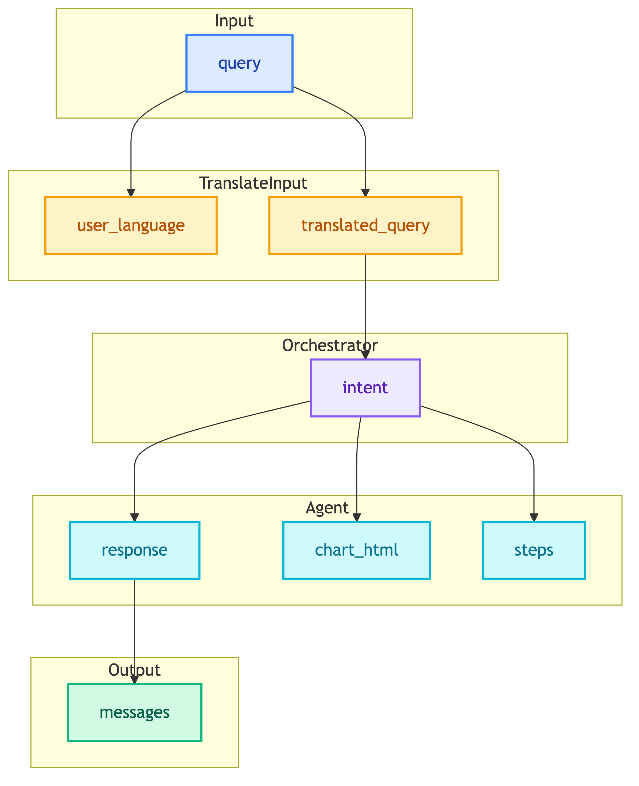

# **📋 ClientChatbotState**

State definition for ClientChatbotWorkflow.


---


## **📍 Location**

[`src/modules/workflows/client_chatbot/state.py`](../../../../../src/modules/workflows/client_chatbot/state.py)


---


## **📋 State Definition**

```python
class ClientChatbotState(TypedDict):
    messages: Annotated[list[BaseMessage], add_messages]
    query: str
    user_language: Optional[str]
    translated_query: Optional[str]
    intent: Optional[Intent]
    response: Optional[str]
    chart_html: Optional[str]
    steps: Annotated[list[dict], add_steps]
```


---


## **📊 Fields**

| Field | Type | Reducer | Description |
|-------|------|---------|-------------|
| messages | list[BaseMessage] | add_messages | Conversation history (auto-appends) |
| query | str | - | User's raw input query |
| user_language | str | - | Detected language ("th" or "en") |
| translated_query | str | - | Query translated to English |
| intent | Intent | - | Classified intent type |
| response | str | - | Final response text |
| chart_html | str | - | Plotly visualization HTML |
| steps | list[dict] | add_steps | Tool execution trace (auto-appends) |


---


## **🎯 Intent Enum**

```python
class Intent(str, Enum):
    CHAT_HISTORY = "chat_history"
    INSIGHT = "insight"
```

| Intent | Description | Routed To |
|--------|-------------|-----------|
| CHAT_HISTORY | Customer chat lookup | CustomerChatHistoryAgent |
| INSIGHT | Analytics/BI query | CustomerInsightAgent |


---


## **🔧 Reducers**


### 📝 **add_messages**

LangGraph built-in reducer that appends new messages to the list.

```python
messages: Annotated[list[BaseMessage], add_messages]
```


### 📝 **add_steps**

Custom reducer that appends tool execution steps.

```python
def add_steps(left: list[dict], right: list[dict]) -> list[dict]:
    return left + right

steps: Annotated[list[dict], add_steps]
```


---


## **🔄 State Flow**

<details>
<summary>📊 State Flow</summary>



</details>


---


## **💡 Example State**

```python
{
    "messages": [
        HumanMessage(content="ยอดขายเดือนนี้"),
        AIMessage(content="ยอดขายเดือนนี้รวม 1.5 ล้านบาท")
    ],
    "query": "ยอดขายเดือนนี้",
    "user_language": "th",
    "translated_query": "Sales this month",
    "intent": Intent.INSIGHT,
    "response": "ยอดขายเดือนนี้รวม 1.5 ล้านบาท",
    "chart_html": "<div id='plotly'>...</div>",
    "steps": [
        {
            "tool": "sql_analytics",
            "input": "SELECT SUM(amount) FROM sales...",
            "output": "1500000"
        }
    ]
}
```
