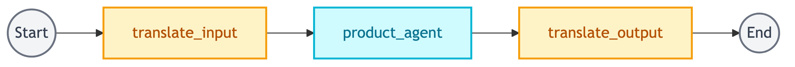
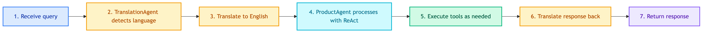

# **🛒 CustomerChatbotWorkflow**

Customer-facing shopping assistant workflow.


---


## **📍 Location**

[`src/modules/workflows/customer_chatbot/main.py`](../../../../../src/modules/workflows/customer_chatbot/main.py)


---


## **💡 Purpose**

Orchestrate agents for customer shopping queries:
- Product search and recommendations
- Order placement and cancellation
- Stock and price inquiries


---


## **📊 Graph Structure**




---


## **🔄 Code Flow**




---


## **🤖 Agents Reference**

| Agent | Location | Purpose | Documentation |
|-------|----------|---------|---------------|
| TranslationAgent | `src/modules/agents/translation/` | Detect language, translate TH ↔ EN | [translation/main.md](../../agents/translation/main.md) |
| ProductAgent | `src/modules/agents/products/main.py` | ReAct agent for shopping queries | [products/main.md](../../agents/products/main.md) |


---


## **🔧 Tools Reference**

| Tool | Purpose | Documentation |
|------|---------|---------------|
| ProductSearchTool | Semantic product search | [vectordb/search.md](../../tools/knowledge_retrieval/vectordb/search.md) |
| SimilarProductsTool | Find similar products | [vectordb/similar.md](../../tools/knowledge_retrieval/vectordb/similar.md) |
| ProductSQLTool | Product stock/price queries | [sql/customer/product.md](../../tools/knowledge_retrieval/sql/customer/product.md) |
| OrderSQLTool | Order history lookup | [sql/customer/order.md](../../tools/knowledge_retrieval/sql/customer/order.md) |
| PlaceOrderTool | Create new orders | [sql/customer/place_order.md](../../tools/knowledge_retrieval/sql/customer/place_order.md) |
| CancelOrderTool | Cancel existing orders | [sql/customer/cancel_order.md](../../tools/knowledge_retrieval/sql/customer/cancel_order.md) |


---


## **📋 State**

See [state.md](state.md) for full state definition.

| Field | Type | Description |
|-------|------|-------------|
| messages | list[BaseMessage] | Conversation history |
| query | str | User's raw input |
| customer_id | str | Customer identifier |
| response | str | Final response |
| steps | list[dict] | Tool execution steps |


---


## **🔧 Node Implementation**


### 🌐 **translate_input**

```python
def _translate_input(self, state: ShoppingState) -> dict:
    # 1. Get query from state
    # 2. Call TranslationAgent.execute()
    # 3. Return user_language + translated_query
```


### 🛒 **product_agent**

```python
def _product_agent(self, state: ShoppingState) -> dict:
    # 1. Get translated_query + customer_id
    # 2. Call ProductAgent.execute() with ReAct loop
    # 3. Return response + steps
```


### 🌐 **translate_output**

```python
def _translate_output(self, state: ShoppingState) -> dict:
    # 1. Get response + user_language
    # 2. If not English, translate back
    # 3. Return final response
```


---


## **🧠 Memory Architecture**

| Type | Storage | Purpose | TTL |
|------|---------|---------|-----|
| Short-term | Redis Checkpointer | Per-thread conversation state | 60 min |
| Long-term | Postgres Store | Cross-thread backup | Permanent |


---


## **💡 Example Flows**


### 🔍 **Product Search**

```
Query: "หาลำโพง bluetooth"

1. translate_input → detected: "th", translated: "Find bluetooth speaker"
2. product_agent → ReAct calls ProductSearchTool
3. translate_output → translates product list to Thai
```


### 📦 **Place Order**

```
Query: "สั่งซื้อ 2 ชิ้น"

1. translate_input → detected: "th", translated: "Order 2 items"
2. product_agent → ReAct calls PlaceOrderTool with product from context
3. translate_output → translates confirmation to Thai
```


### 📊 **Check Stock**

```
Query: "เหลือกี่ชิ้น"

1. translate_input → detected: "th", translated: "How many left in stock"
2. product_agent → ReAct calls ProductSQLTool for stock query
3. translate_output → translates stock info to Thai
```


---


## **🔗 Related Files**

| File | Purpose |
|------|---------|
| `src/modules/workflows/customer_chatbot/state.py` | State definition |
| `src/repositories/chatbots/customer/main.py` | Compiles graph with memory |
| `src/dependencies/customer_chatbot.py` | Dependency injection |
| `configs/agents/customer_chatbot.yaml` | Configuration |
