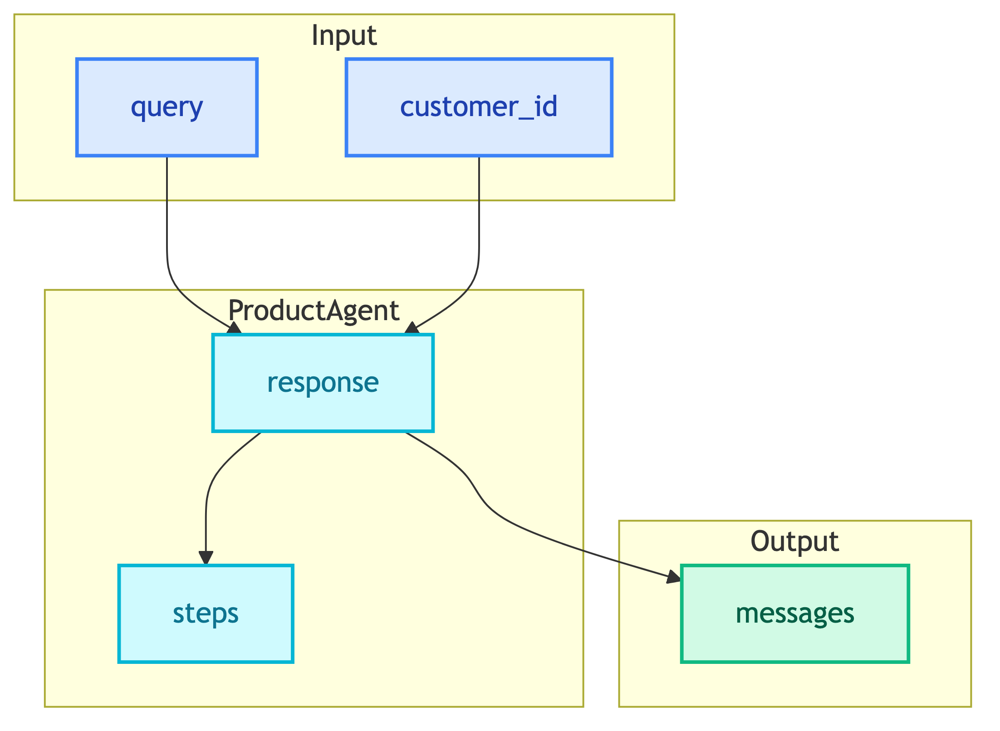

# **📋 ShoppingState**

State definition for CustomerChatbotWorkflow.


---


## **📍 Location**

[`src/modules/workflows/customer_chatbot/state.py`](../../../../../src/modules/workflows/customer_chatbot/state.py)


---


## **📋 State Definition**

```python
class ShoppingState(TypedDict):
    messages: Annotated[list[BaseMessage], add_messages]
    query: str
    customer_id: Optional[str]
    response: Optional[str]
    steps: Annotated[list[dict], add_steps]
```


---


## **📊 Fields**

| Field | Type | Reducer | Description |
|-------|------|---------|-------------|
| messages | list[BaseMessage] | add_messages | Conversation history (auto-appends) |
| query | str | - | User's raw input query |
| customer_id | str | - | Customer identifier for orders |
| response | str | - | Final response text |
| steps | list[dict] | add_steps | Tool execution trace (auto-appends) |


---


## **🔧 Reducers**


### 📝 **add_messages**

LangGraph built-in reducer that appends new messages to the list.

```python
messages: Annotated[list[BaseMessage], add_messages]
```


### 📝 **add_steps**

Custom reducer that appends tool execution steps.

```python
def add_steps(left: list[dict], right: list[dict]) -> list[dict]:
    return left + right

steps: Annotated[list[dict], add_steps]
```


---


## **🔄 State Flow**




---


## **💡 Example State**

```python
{
    "messages": [
        HumanMessage(content="หาลำโพง bluetooth"),
        AIMessage(content="พบลำโพง bluetooth 5 รายการ:\n1. JBL Flip 6...")
    ],
    "query": "หาลำโพง bluetooth",
    "customer_id": "cust-123",
    "response": "พบลำโพง bluetooth 5 รายการ:\n1. JBL Flip 6...",
    "steps": [
        {
            "tool": "product_search",
            "input": "bluetooth speaker",
            "output": "[{\"name\": \"JBL Flip 6\", ...}]"
        }
    ]
}
```


---


## **📊 Comparison with ClientChatbotState**

| Feature | ShoppingState | ClientChatbotState |
|---------|---------------|-------------------|
| Intent routing | No | Yes (CHAT_HISTORY/INSIGHT) |
| Visualization | No | Yes (chart_html) |
| Customer context | customer_id | No |
| Translation fields | No (handled internally) | Yes (user_language, translated_query) |
