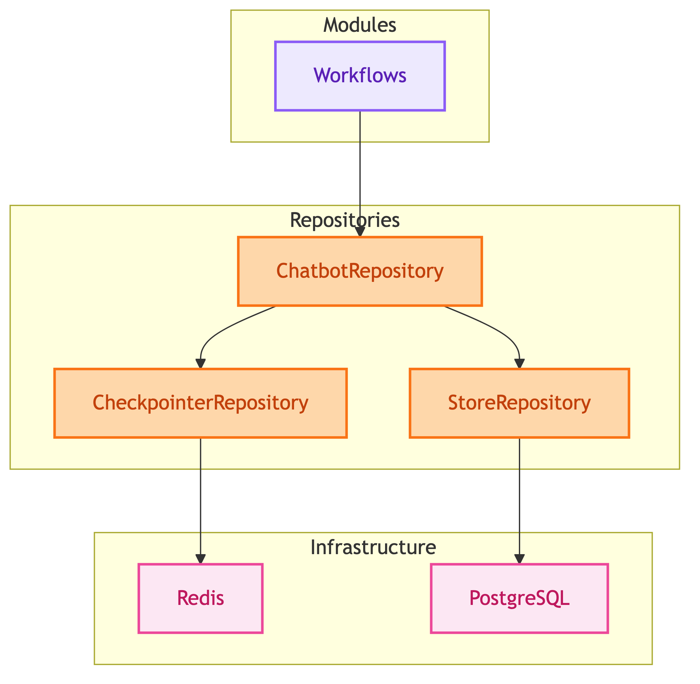
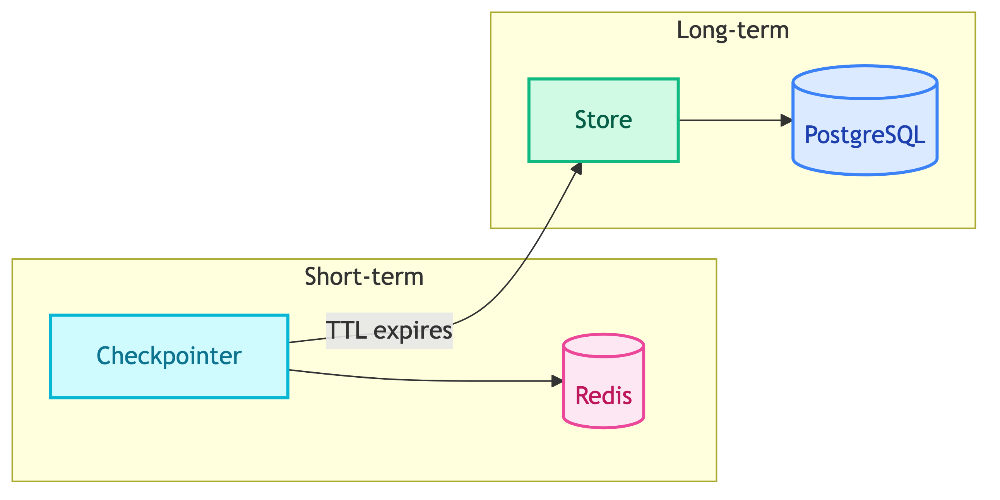

# **🗂️ Repositories**

Domain-specific data access layer that abstracts infrastructure from business logic.


---


## **📍 Location**

[`src/repositories/`](../../../src/repositories/)


---


## **📋 Overview**

Repositories bridge the gap between modules (workflows/agents) and infrastructure (databases/caches).

<details>
<summary>📊 Overview</summary>



</details>


---


## **🧩 Components**

| | | |
|:---:|:---:|:---:|
| [🤖 **Chatbots**](chatbots/README.md)<br/>Compile workflow + memory management | [⏱️ **Checkpointers**](checkpointers/README.md)<br/>Short-term memory (per-thread, TTL) | [💾 **Stores**](stores/README.md)<br/>Long-term memory (cross-thread, permanent) |


---


## **📊 Repository vs libs/**

| Layer | Scope | Example |
|-------|-------|---------|
| `libs/` | Generic infrastructure (cross-project) | `RedisClient`, `PostgresClient` |
| `repositories/` | Domain-specific (project-specific) | `CustomerChatbotRepository`, `RedisCheckpointerRepository` |


---


## **🧠 Memory Architecture**



| Type | Storage | TTL | Purpose |
|------|---------|-----|---------|
| Short-term | Redis Checkpointer | 60 min | Per-thread conversation state |
| Long-term | Postgres Store | Permanent | Backup, audit, cross-thread |


---


## **📝 Design Decisions**

| Decision | Description | Link |
|----------|-------------|------|
| Checkpointer + Store | Why we use both memory types | [why_checkpointer_and_store.md](../../decisions/why_checkpointer_and_store.md) |


---


## **🔮 Future Improvements**

| Improvement | Description | Link |
|-------------|-------------|------|
| Async Store Writes | Queue or scheduled job for async Postgres writes | [async_store_writes.md](../../future_improvements/chat_history/async_store_writes.md) |


---


## **📂 File Structure**

```
src/repositories/
├── chatbots/
│   ├── base.py                    # BaseChatbotRepository
│   ├── client/main.py             # ClientChatbotRepository
│   └── customer/main.py           # CustomerChatbotRepository
├── checkpointers/
│   ├── base.py                    # BaseCheckpointerRepository
│   ├── redis/main.py              # RedisCheckpointerRepository
│   └── memory/main.py             # MemoryCheckpointerRepository
└── stores/
    ├── base.py                    # BaseStoreRepository
    └── postgres/main.py           # PostgresStoreRepository
```
