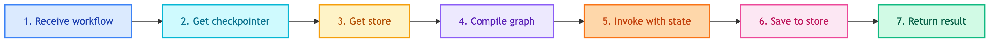

# **🤖 Chatbot Repositories**

Compile workflows with memory and provide unified interface for chatbot operations.


---


## **📍 Location**

[`src/repositories/chatbots/`](../../../../src/repositories/chatbots/)


---


## **📋 Overview**

Chatbot repositories:
1. Receive uncompiled workflow from modules layer
2. Compile with checkpointer (short-term) + store (long-term)
3. Provide `invoke`, `get_history`, `clear_conversation` methods


---


## **🔄 Code Flow**




---


## **🎯 Base Interface**

```python
class BaseChatbotRepository(ABC):
    def __init__(
        self,
        checkpoint_repo: Optional[BaseCheckpointerRepository] = None,
        store_repo: Optional[BaseStoreRepository] = None,
    )

    @abstractmethod
    def invoke(self, query: str, thread_id: str, user_id: Optional[str] = None) -> dict

    def get_history(self, thread_id: str) -> list[BaseMessage]
    def clear_conversation(self, thread_id: str) -> None
    def _save_to_store(self, query, response, thread_id, user_id) -> None
```


---


## **📦 Implementations**

| | |
|:---:|:---:|
| [💼 **ClientChatbotRepository**](client/main.md)<br/>Internal BI chatbot | [👤 **CustomerChatbotRepository**](customer/main.md)<br/>Shopping assistant |


---


## **❓ Why Repository Pattern?**

Same interface for multiple chatbot types:

```python
# Current
ClientChatbotRepository    # Internal BI chatbot
CustomerChatbotRepository  # Shopping assistant

# Future
SupportChatbotRepository   # Support ticket chatbot
SalesChatbotRepository     # Sales qualification chatbot
```

All share the same interface: `invoke`, `get_history`, `clear_conversation`.
