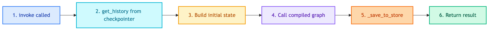

# **🤖 BaseChatbotRepository**

Abstract base class for all chatbot repositories.


---


## **📍 Location**

[`src/repositories/chatbots/base.py`](../../../../src/repositories/chatbots/base.py)

---


## **📋 Class Definition**

```python
class BaseChatbotRepository(ABC):
    def __init__(
        self,
        checkpoint_repo: Optional[BaseCheckpointerRepository] = None,
        store_repo: Optional[BaseStoreRepository] = None,
    ):
        self.checkpoint_repo = checkpoint_repo
        self.store_repo = store_repo

    @abstractmethod
    def invoke(
        self,
        query: str,
        thread_id: str,
        user_id: Optional[str] = None,
    ) -> dict:
        pass

    def get_history(self, thread_id: str) -> list[BaseMessage]:
        ...

    def clear_conversation(self, thread_id: str) -> None:
        ...

    def _save_to_store(
        self,
        query: str,
        response: Optional[str],
        thread_id: str,
        user_id: Optional[str] = None,
    ) -> None:
        ...
```


---


## **💡 Purpose**

1. **Define contract** - All chatbot repositories implement same interface
2. **Memory management** - Handle checkpointer and store injection
3. **History access** - Unified way to get/clear conversation history
4. **Long-term save** - Auto-save to store for audit/backup


---


## **🔄 Code Flow**




---


## **🔧 Methods**


### 📤 **invoke() → dict**

Abstract method that subclasses must implement.

| Input | Type | Description |
|-------|------|-------------|
| query | str | User's input |
| thread_id | str | Conversation thread ID |
| user_id | str | Optional user ID |

| Output | Type | Description |
|--------|------|-------------|
| result | dict | Final state with response, steps, etc. |

### 📜 **get_history() → list[BaseMessage]**

Get conversation history from checkpointer.

```python
def get_history(self, thread_id: str) -> list[BaseMessage]:
    if not self.checkpoint_repo:
        return []
    checkpoint = self.checkpoint_repo.get_checkpoint(thread_id)
    if checkpoint and checkpoint.checkpoint:
        return checkpoint.checkpoint.get("channel_values", {}).get("messages", [])
    return []
```

### 🗑️ **clear_conversation() → None**

Clear conversation from checkpointer.

```python
def clear_conversation(self, thread_id: str) -> None:
    if self.checkpoint_repo:
        self.checkpoint_repo.delete_checkpoint(thread_id)
```

### 💾 **_save_to_store() → None**

Save conversation turn to long-term memory.

```python
def _save_to_store(self, query, response, thread_id, user_id) -> None:
    if not self.store_repo or not user_id:
        return

    namespace = ("users", user_id, "conversations")
    key = f"{thread_id}_{timestamp}_{uuid}"

    self.store_repo.put(namespace, key, {
        "query": query,
        "response": response,
        "thread_id": thread_id,
        "timestamp": datetime.now().isoformat(),
    })
```


---


## **💡 Usage**

```python
class MyChatbotRepository(BaseChatbotRepository):
    def __init__(self, workflow, checkpoint_repo, store_repo):
        super().__init__(checkpoint_repo, store_repo)
        self.app = workflow.build().compile(
            checkpointer=checkpoint_repo.checkpointer,
            store=store_repo.store,
        )

    def invoke(self, query, thread_id, user_id=None):
        history = self.get_history(thread_id)
        result = self.app.invoke({"messages": history, "query": query}, ...)
        self._save_to_store(query, result["response"], thread_id, user_id)
        return result
```
