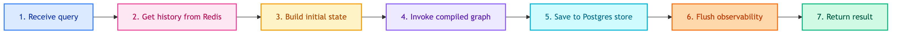

# **🛒 CustomerChatbotRepository**

Repository for customer shopping assistant chatbot.


---


## **📍 Location**

[`src/repositories/chatbots/customer/main.py`](../../../../../src/repositories/chatbots/customer/main.py)

---


## **💡 Purpose**

Compile CustomerChatbotWorkflow with memory and provide invoke interface.


---


## **🔄 Code Flow**




---


## **📋 Class Definition**

```python
class CustomerChatbotRepository(BaseChatbotRepository):
    def __init__(
        self,
        workflow: CustomerChatbotWorkflow,
        checkpoint_repo: Optional[BaseCheckpointerRepository] = None,
        store_repo: Optional[BaseStoreRepository] = None,
        observability: Optional[BaseObservability] = None,
    ):
        super().__init__(checkpoint_repo, store_repo)
        self.observability = observability
        
        # Compile graph with memory
        checkpointer = checkpoint_repo.checkpointer if checkpoint_repo else None
        store = store_repo.store if store_repo else None
        self.app = workflow.build().compile(checkpointer=checkpointer, store=store)
```


---


## **📥 Input/Output**


### 📥 **Input State**

| Field | Type | Description |
|-------|------|-------------|
| messages | list[BaseMessage] | History from checkpointer |
| query | str | User's raw input |
| customer_id | str | Customer ID (from user_id) |
| user_language | None | Will be detected |
| translated_query | None | Will be translated |
| response | None | Will be generated |
| steps | [] | Tool execution trace |

### 📤 **Output State**

| Field | Type | Description |
|-------|------|-------------|
| response | str | Final response in user's language |
| steps | list[dict] | Tool calls and results |


---


## **🔗 Workflow Reference**

| Component | Documentation |
|-----------|---------------|
| CustomerChatbotWorkflow | [workflows/customer_chatbot/main.md](../../../modules/workflows/customer_chatbot/main.md) |
| ShoppingState | [workflows/customer_chatbot/state.md](../../../modules/workflows/customer_chatbot/state.md) |


---


## **💡 Usage**

```python
from src.repositories.chatbots.customer.main import CustomerChatbotRepository

repo = CustomerChatbotRepository(
    workflow=workflow,
    checkpoint_repo=redis_checkpoint_repo,
    store_repo=postgres_store_repo,
    observability=langfuse_observability,
)

result = repo.invoke(
    query="หาลำโพง bluetooth",
    thread_id="thread-123",
    user_id="cust-456",
)

print(result["response"])  # Thai response with product list
print(result["steps"])     # Tool execution trace
```
